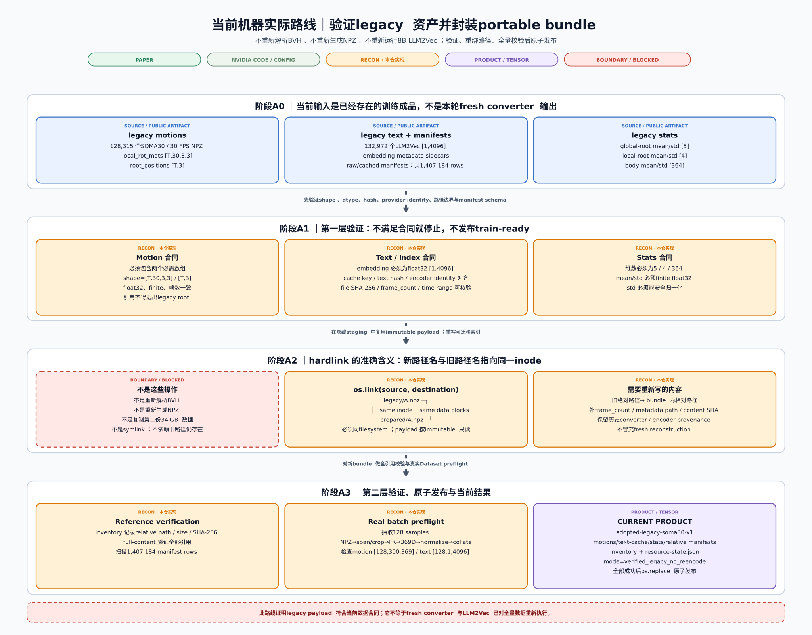
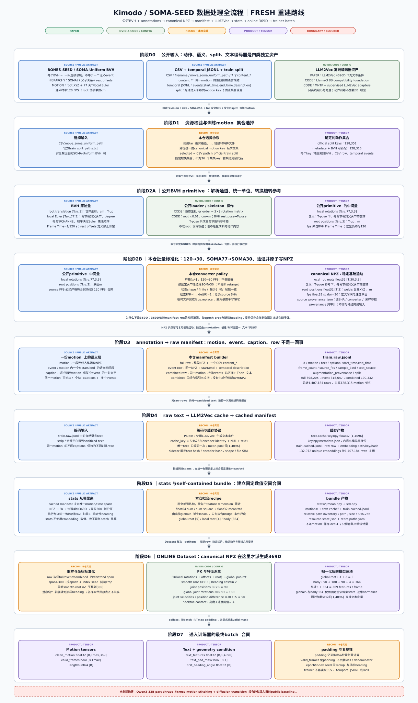
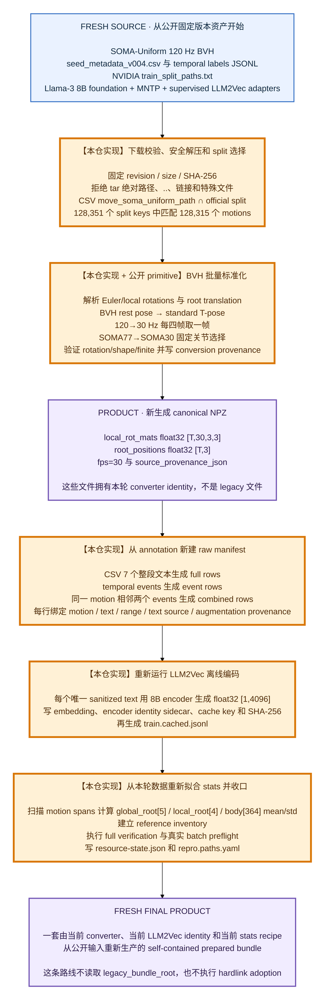
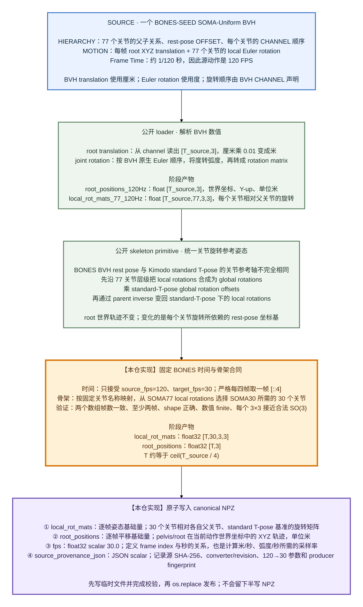
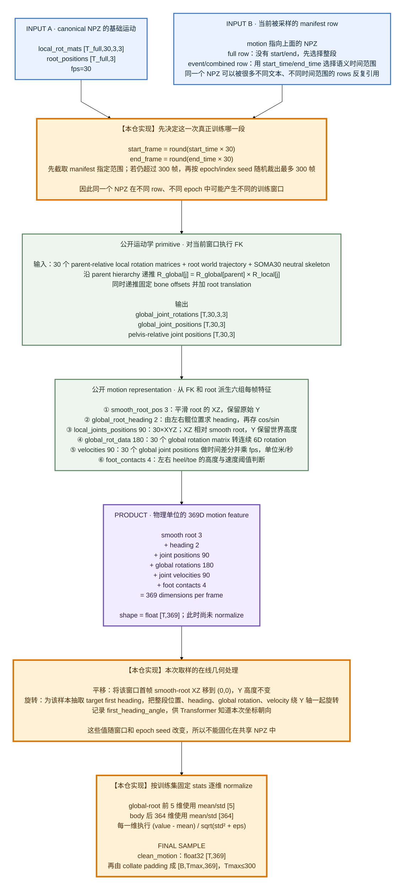
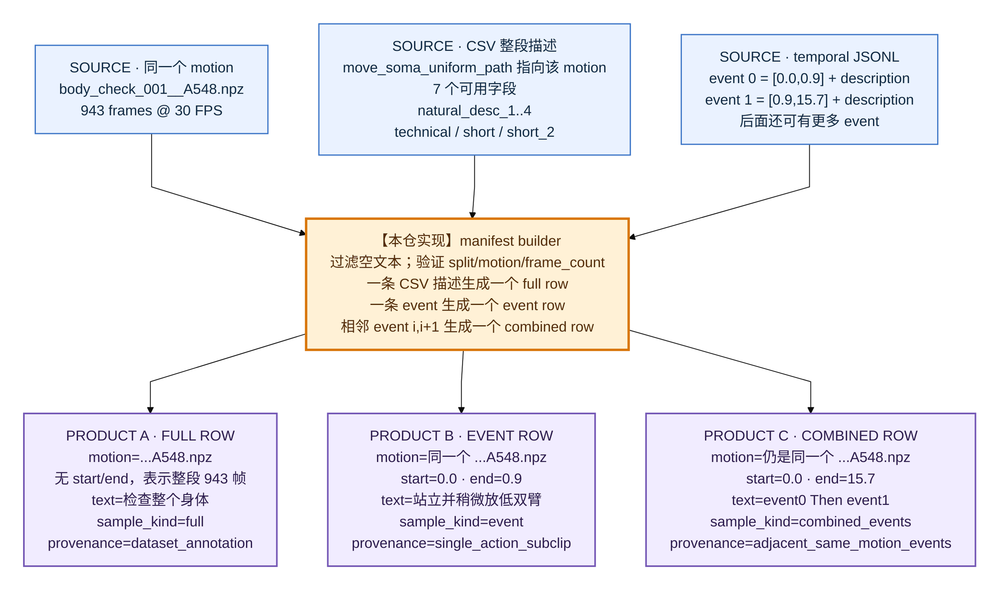
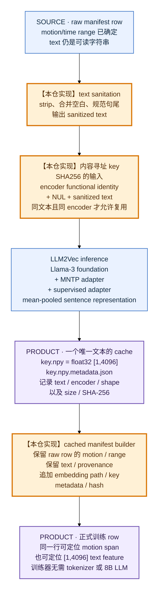
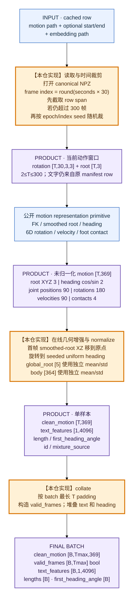
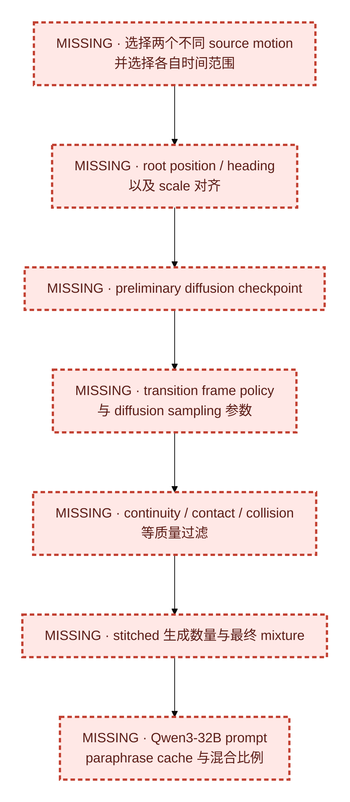

# Kimodo-SOMA-SEED 数据处理 Flow

这份图只回答四件事：原始数据是什么、当前代码做了什么、每一步产物长什么样、训练器最终读什么。

最重要的边界先写在前面：当前仓库**没有生成** Qwen3-32B paraphrase，也**没有实现**跨两个动作的
cross-motion stitching 与 diffusion transition。当前可训练数据由原始 full caption、单个 temporal event、
同一真实 motion 内的相邻两个 event 组成。

## 技术分享版总图

下面两张不是同一条执行链。图 A 是当前机器训练前**真正执行过**的 legacy adoption；图 B 是没有历史成品时，
从公开数据 fresh 重建的完整语义链。两张图均为 3600 px 宽的纯 SVG，点击标题可打开原尺寸，适合投屏、放大或
导出 PDF；不使用会在部分渲染器中丢字的 `foreignObject`。

### 图 A：当前实际执行的 verified legacy adoption

[打开 3600 px SVG 原图](assets/data_bundle_adoption_technical_share.svg)



### 图 B：从公开资产 fresh 重建的数据语义链

[打开 3600 px SVG 原图](assets/data_pipeline_technical_share.svg)



两图统一证据配色：绿色是论文明确内容，灰绿色是 NVIDIA 公开 code/config，橙色是本仓自行实现，紫色是实际
产物或张量，红色虚线是未复现项或必须强调的边界。蓝色只表示下载/已有输入资产，不等于论文方法证据。

## 图例

| 颜色 | 含义 |
|---|---|
| 蓝色 | 下载或已有的源数据 |
| 橙色粗框 | **本仓自行实现的处理或工程协议** |
| 紫色 | 一个阶段实际产出的数据 |
| 青色 | 训练时在线执行 |
| 红色虚线 | 论文提及但当前没有完成 |

## 1. 先分清两条独立路线

这里存在两条互相替代的准备路线，不是“fresh 做完以后再 hardlink”：

- **路线 A：当前机器实际使用。** 已经存在一套历史转换成品，所以验证并迁移这套成品，不重新跑 BVH
  转换，也不重新跑 8B LLM2Vec。
- **路线 B：从公开源数据 fresh 构建。** 从 BVH、CSV、temporal labels 和 LLM2Vec 权重开始，重新生成
  NPZ、manifest、embedding 和 stats。这条路线不需要 legacy bundle，也没有 adoption。

### 1.1 当前实际运行的是“验证历史成品并建立 portable bundle”

```mermaid
%%{init: {"theme":"base","flowchart":{"htmlLabels":true,"curve":"linear","useMaxWidth":false,"wrappingWidth":820,"diagramPadding":30,"nodeSpacing":64,"rankSpacing":80},"themeVariables":{"fontFamily":"Arial, Droid Sans Fallback, sans-serif","fontSize":"18px"},"themeCSS":".nodeLabel,.edgeLabel{text-align:center!important;line-height:1.7!important;padding:12px!important}.node foreignObject{overflow:visible!important}"}}%%
flowchart TB
    classDef source fill:#EAF2FF,stroke:#3973C6,color:#102A43,stroke-width:2px;
    classDef ours fill:#FFF1D6,stroke:#D97706,color:#542D08,stroke-width:4px;
    classDef product fill:#F1ECFF,stroke:#7457B5,color:#2D1D4E,stroke-width:2.5px;
    classDef current fill:#E6F8FC,stroke:#168AAD,color:#123B46,stroke-width:4px;

    A["CURRENT SOURCE · 历史训练资产目录<br/><br/>/home/metaiot/Workspace/yzt/kimodo-training-data<br/><br/>里面已经有<br/>128,315 个 SOMA30 / 30 FPS motion NPZ<br/>132,972 个 LLM2Vec embedding<br/>raw/cached manifest 和 global/local/body stats<br/><br/>它们是早先生成的真实成品，不是本轮 fresh converter 的输出"]:::source

    B["【本仓实现】第一层验证：先判断历史成品能不能被安全复用<br/><br/>manifest 必须能解析，motion/text 路径必须位于声明的 legacy 根目录内<br/>motion NPZ 必须包含 local_rot_mats [T,30,3,3] 与 root_positions [T,3]<br/>embedding 必须为 float32 [1,4096]，cache key、文本 hash、内容 hash、provider identity 必须一致<br/>stats 必须是 global_root [5]、local_root [4]、body [364] 的 finite float32 mean/std<br/><br/>任何一项不一致就停止，不会把文件标成 train-ready"]:::ours

    C["【本仓实现】建立临时 staging 目录<br/><br/>先写到 prepared 根目录旁边的隐藏临时目录<br/>.<bundle-name>.adopting.<random><br/><br/>迁移没有全部完成前，trainer 看不到半成品目录"]:::ours

    D["【本仓实现】对大文件执行 os.link，而不是复制字节<br/><br/>每个唯一 motion NPZ、text embedding、stats mean/std<br/>在 staging 目录中创建一个新的目录项<br/>新路径与历史路径指向同一个 filesystem inode<br/><br/>没有再次解析 BVH<br/>没有再次生成 motion<br/>没有再次运行 LLM2Vec<br/>没有占用第二份 34 GB 资产数据空间"]:::ours

    E["PRODUCT · 同一份字节现在有两个路径名称<br/><br/>legacy 路径<br/>kimodo-training-data/motions/.../body_check...A548.npz<br/><br/>prepared 路径<br/>.../adopted-legacy-soma30-v1/motions/.../body_check...A548.npz<br/><br/>实测两者 device=2050、inode=189008981、nlink=2、size=1,034,900<br/>所以它们是同一文件内容的两个硬链接名称"]:::product

    F["【本仓实现】重写可迁移的索引和 provenance<br/><br/>旧 manifest 中可能存在旧机器绝对路径<br/>新 raw/cached manifest 逐行重写成相对 prepared 根目录的路径<br/>补齐 frame_count、embedding metadata path 和 content SHA-256<br/>保留历史 encoder/provider/converter 身份，不冒充本轮重新编码<br/>stats 数值文件可 hardlink，但 stats.metadata.json 重新绑定新 manifest"]:::ours

    G["PRODUCT · portable bundle 目录结构<br/><br/>train.raw.jsonl 与 train.cached.jsonl：新写的相对路径索引<br/>motions/：指向已验证历史 NPZ 的硬链接<br/>text-cache/：embedding 硬链接 + 新的可审计 metadata sidecar<br/>stats/：mean/std 硬链接 + 重新绑定后的 stats.metadata.json<br/><br/>portable 的意思是整个目录搬到另一台机器后，可以重新 bind 本机绝对路径"]:::product

    H["【本仓实现】第二层验证：验证新 bundle，而不只相信旧目录<br/><br/>构建 reference inventory，逐个记录 relative path / size / SHA-256<br/>对全部引用文件做 full-content verification<br/>扫描 1,407,184 个 manifest rows 的 schema、路径、embedding sidecar 和 frame_count<br/>实际读取 128 个样本，执行 FK / 369D / normalize / collate<br/>检查 batch motion [128,300,369] 与 text [128,1,4096]"]:::ours

    I["【本仓实现】原子发布与路径绑定<br/><br/>所有验证通过后，os.replace 将 staging 一次性改名为最终 prepared_root<br/>写 resource-state.json，状态为 repro_train_ready<br/>写 repro.paths.yaml，给 trainer 指明 manifest / inventory / stats / run 输出目录<br/><br/>若任何步骤失败，临时目录删除，最终目录不会出现半成品"]:::ours

    J["CURRENT FINAL PRODUCT · 本轮短训真正读取<br/><br/>/home/metaiot/Workspace/yzt/kimodo-portable-runtime/<br/>prepared/adopted-legacy-soma30-v1<br/><br/>128,315 motions<br/>1,407,184 manifest rows<br/>132,972 unique text embeddings<br/>394,262 inventory references<br/><br/>模式名称：verified_legacy_no_reencode"]:::current

    A --> B --> C --> D --> E --> F --> G --> H --> I --> J
```



### 1.2 hardlink 到底是什么

hardlink 不是“再处理一次”，也不是“复制后建立关联”。Linux 文件可以粗略理解成：

```text
目录中的文件名 ──指向── inode ──指向── 磁盘数据块
```

执行：

```python
os.link(source, destination)
```

之后变成：

```text
legacy/motions/A.npz  ─┐
                       ├── inode 189008981 ── 唯一一份磁盘数据
prepared/motions/A.npz ┘
```

因此它与 copy、symlink 的区别是：

| 操作 | 数据是否复制一份 | 新路径是否依赖旧路径仍存在 | 当前 adoption 是否使用 |
|---|---:|---:|---:|
| copy | 是 | 否 | 可选，配置 `asset_mode=copy` 时使用 |
| symlink 软链接 | 否 | **是**，旧路径删除后软链接会断 | 否 |
| hardlink 硬链接 | 否 | 否；两个名字地位相同 | **当前使用** |

hardlink 有两个限制：

1. source 和 destination 必须位于同一个 filesystem；否则代码直接报错，要求改用 `copy`。
2. 两个路径指向同一 inode，因此从任一路径修改内容都会影响另一条路径。当前 pipeline 把这些资产当作
   immutable，只读并用 SHA-256 校验，不应原地修改。

删除旧路径只会让 `nlink` 从 2 变成 1；只要 prepared 路径还存在，数据块仍然存在，不会像 symlink 一样断。

### 1.3 如果没有历史成品，才走 fresh public preparation



两条路线最终都要满足相同的 trainer 输入合同，但 provenance 不同。当前实际 bundle 的 provenance 明确是
`verified_legacy_no_reencode`；不能把它描述为 fresh converter 的全量产物。

## 2. 动作数据：BVH 为什么要变成 NPZ

这里必须区分两层数据：

```text
canonical NPZ = 可以反复派生训练特征的基础运动数据
369D tensor   = 针对某个 manifest row、某次 crop、某次随机 heading 临时生成的模型表示
```

369D 没有丢失。它不属于 fresh canonical NPZ 的固定字段，而是在 Dataset 取样时由 NPZ 计算出来。

### 2.1 BVH 经过哪些操作，才得到 NPZ 四个字段



当前 fresh converter 的精确输出合同：

```python
{
    "local_rot_mats": float32[T, 30, 3, 3],
    "root_positions": float32[T, 3],
    "fps": float32(30.0),
    "source_provenance_json": "{source hash, converter identity, ...}",
}
```

四个字段的职责不同：

| 字段 | 从什么操作得到 | 物理/坐标含义 | 后续用来做什么 |
|---|---|---|---|
| `local_rot_mats [T,30,3,3]` | BVH Euler→矩阵、rest-pose 变换、120→30、77→30 | 每个关节相对父关节的局部旋转；不是 global rotation | 配合固定 SOMA30 骨架做 FK，恢复所有关节的 global rotation 和 position |
| `root_positions [T,3]` | BVH root translation、厘米→米、120→30 | pelvis/root 在动作世界坐标中的 XYZ；Y-up、单位米 | 给 FK 提供整个人的平移；生成 smooth root、root trajectory 和速度 |
| `fps` | converter 固定的目标采样率 | 一帧代表 `1/30` 秒 | 秒数范围→frame index；位置差分→米/秒；heading 差分→弧度/秒 |
| `source_provenance_json` | converter 根据输入与代码身份生成 | 审计元数据，不是运动特征 | 判断缓存是否过期、证明 NPZ 来自哪个 BVH/转换器；不送入模型 |

当前 adopted legacy NPZ 还可能多一个 `semantic_contract_json`。它也是历史语义/生产者元数据，不是
Transformer 的运动输入。

### 2.2 NPZ 四字段怎样在 Dataset 中变成 369D



### 2.3 为什么不直接把 369D 存进每个 NPZ

因为 369D 不是该 motion 唯一不变的事实，而是“基础动作 + 当前样本选择 + 当前增强”的结果：

1. **一个 NPZ 对应很多 manifest rows。** full、event、combined 可能选择不同时间范围。如果每个 row 各存
   一份 369D，会大量重复同一个动作。
2. **超过 300 帧时每个 epoch 可以随机裁到不同窗口。** 速度末帧处理、smooth-root 平滑和接触计算应与当前
   有效窗口/length 一致。
3. **首帧 heading 是在线随机增强。** 同一动作可在不同 epoch 被整体旋转到不同方向，提前固化会失去增强。
4. **369D 中大部分信息可从基础量重算。** global rotations/positions 来自 FK，速度来自差分，heading 来自
   髋关节，contact 来自脚部位置和速度；全部保存会同时保存基础量和大量冗余派生量。
5. **避免派生特征与代码/stats 失配。** FK、smooth-root 或 contact 实现改变时，可以从相同 canonical NPZ
   重建，而不会让磁盘中的旧 369D 静默沿用过期语义。

所以 NPZ 的设计原则是：

```text
离线只保存足以重建动作的稳定基础量
    = local joint rotations + root trajectory + time rate

在线根据当前 row / crop / augmentation 生成模型实际需要的 369D
```

### 2.4 conversion inventory 不是第五个 NPZ 特征

conversion inventory 独立于 NPZ，一行描述一次转换和产物校验：

```json
{
  "source": "soma_uniform/bvh/210531/jump_and_land_heavy_001__A001.bvh",
  "source_sha256": "64b0af...",
  "cached": "210531/jump_and_land_heavy_001__A001.npz",
  "cached_sha256": "1ef33e...",
  "frames": 366,
  "fps": 30.0,
  "producer_fingerprint_sha256": "..."
}
```

## 3. annotation、motion、event 和 manifest row 的关系

一个 BVH/NPZ 是一次连续动作录制；event 是这段录制中具有单独语义的时间区间；manifest row 是一次可被
采样的“动作范围 + 文本”训练关系。三者不是一对一。



实际 event row：

```json
{
  "id": "body_check_001__A548:event:0:0",
  "motion": "motions/soma30-30fps/240918/body_check_001__A548.npz",
  "start_time": 0.0,
  "end_time": 0.9,
  "frame_count": 943,
  "source_fps": 30.0,
  "text": "A person stands idle with both arms stretched at the sides. They slightly lower their arms.",
  "sample_kind": "event",
  "text_source": "bones_seed_temporal_label",
  "augmentation_provenance": "single_action_subclip",
  "split": "train"
}
```

当前 row 数自然形成了 DataLoader 的隐式 mixture，而不是论文公布的采样比例：

| row 类型 | 数量 | 比例 | 是否生成新 motion |
|---|---:|---:|---|
| full | 898,205 | 63.83% | 否 |
| event | 318,647 | 22.64% | 否，只裁时间段 |
| combined_events | 190,332 | 13.53% | 否，只扩大同一 motion 的范围 |
| 总计 | 1,407,184 | 100% | — |

## 4. raw manifest 为什么还要经过 LLM2Vec



实际 cached row 的新增部分如下：

```json
{
  "id": "body_check_001__A548:event:0:0",
  "motion": "motions/soma30-30fps/240918/body_check_001__A548.npz",
  "start_time": 0.0,
  "end_time": 0.9,
  "text_embedding": "text-cache/458b4a65....npy",
  "text_embedding_metadata": "text-cache/458b4a65....npy.metadata.json",
  "text_embedding_sha256": "0a70f238...",
  "text_cache_key": "458b4a65..."
}
```

## 5. Dataset 在线处理：NPZ 怎样变成 369D batch



`local_root [4]` 不在 369D target 内。它由 heading angular velocity 1、root XZ velocity 2、root Y 1
构成，只在两阶段模型中充当 global-root Transformer 到 body Transformer 的桥接条件，因此另外保存
`local_root mean/std [4]`。

### 当前保留的数据—文本风险

超过 300 帧的 row 会随机裁成 10 秒，但文本不会随 crop 重新生成：

| 类型 | 超过 300 帧的 row |
|---|---:|
| full | 151,823 |
| event | 12,366 |
| combined_events | 14,335 |

因此部分文本可能描述完整长时间段，而 motion tensor 只是其中随机 10 秒。这是实际存在的弱对齐风险；
论文要求 10 秒 crop，但没有公开这一步的文本重对齐 recipe，所以当前不能武断地定性为 bug。

## 6. stats、inventory 和两个路径 YAML 分别做什么

| 产物 | 典型内容 | 为什么需要 |
|---|---|---|
| `global_root/{mean,std}.npy` | float32 `[5]` | root 位置与 heading 的 normalize/unnormalize |
| `local_root/{mean,std}.npy` | float32 `[4]` | 两阶段 bridge 的 normalize/unnormalize |
| `body/{mean,std}.npy` | float32 `[364]` | body 特征 normalize/unnormalize |
| reference inventory | 每行 `path,size,SHA-256` | 搬迁后逐内容验证 bundle，不只检查“文件存在” |
| `resource-state.json` | row 数、motion/text shape、producer/hash | 证明全量 manifest/preflight 已完成 |
| `paths.local.yaml` | destination、dataset/prepared/run root、workers/device | 用户输入：资源流水线应该把东西放到哪里、怎样准备 |
| `repro.paths.yaml` | manifest、inventory、stats、output/resume | 流水线输出：trainer 最终应该读取哪里 |

stats 的拟合规则也是**本仓工程实现**：按 `(motion,start,end)` 去掉完全重复 caption，时间范围分成不重叠的
最长 300 帧窗口，执行确定性随机 heading，以 float64 累计再保存 float32。full/event/combined 的范围可能
互相重叠，所以相同原始帧仍可能通过不同范围多次进入 stats；官方拟合 recipe 没有公开。

当前机器路径：

```text
原始可见数据  /storage/data/metaiot_data/yzt/seed
用户路径配置  /home/metaiot/Workspace/yzt/kimodo-reproduction/resources/paths.local.yaml
prepared      /home/metaiot/Workspace/yzt/kimodo-portable-runtime/prepared/adopted-legacy-soma30-v1
trainer paths /home/metaiot/Workspace/yzt/kimodo-portable-runtime/config/repro.paths.yaml
run root      /home/metaiot/Workspace/yzt/kimodo-portable-runtime/runs
```

## 7. 本仓实现与未实现内容总表

### 本仓已经实现

- 固定 revision/size/SHA-256 的资源管理和安全解压。
- 官方 split 与 CSV motion 的精确交集、coverage accounting。
- 基于公开 loader/skeleton primitive 的 fresh BVH 批量 converter、验证与 inventory。
- legacy bundle 的全内容验证、hardlink adoption、portable paths 和 schema sidecars。
- full/event/同 motion 相邻 event 的 raw manifest builder。
- LLM2Vec 内容寻址缓存、sidecar、cached manifest。
- stats 拟合、reference inventory、`repro.paths.yaml`、train-ready receipt。
- 在线时间裁剪、369D 派生、随机 heading、normalize、collate。
- 外部增强 row 的严格 schema/provenance gate。

### 当前没有实现



公开 `kimodo_model.py` 的 multi-prompt overlap/constraint/blend 是**推理时**连续生成，不是训练前的
cross-motion augmentation。现有 gate 只负责拒绝 provenance 不完整的外部 stitched row，不会生成这些数据。

## 8. 实现证据入口

- [`kimodo/resources/pipeline.py`](../kimodo/resources/pipeline.py)：资源校验、安全解压、bundle 收口。
- [`kimodo/resources/bones.py`](../kimodo/resources/bones.py)：BONES 选择、fresh converter、conversion inventory。
- [`kimodo/exports/motion_io.py`](../kimodo/exports/motion_io.py)：公开动作 loader/resampling primitive。
- [`kimodo/training/manifest_cli.py`](../kimodo/training/manifest_cli.py)：full/event/combined manifest。
- [`kimodo/training/text_cache_cli.py`](../kimodo/training/text_cache_cli.py)：LLM2Vec cache 与 cached manifest。
- [`kimodo/training/stats_cli.py`](../kimodo/training/stats_cli.py)：stats 拟合。
- [`kimodo/training/data.py`](../kimodo/training/data.py)：在线 Dataset、collate、外部增强门禁。
- [`docs/paper_training_parity_audit.md`](paper_training_parity_audit.md)：论文证据等级与阻断项。
