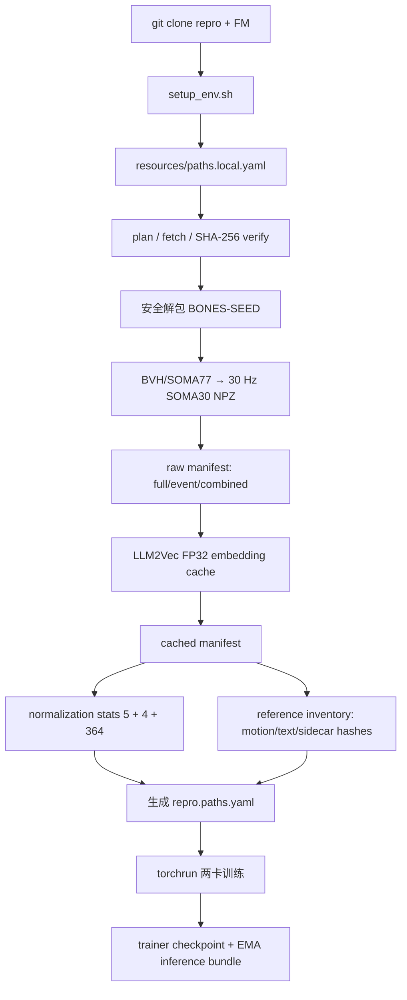
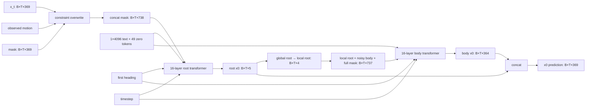

# Kimodo 训练复现：论文贴合度、工程实现与全链路数据流

> 审计基线：Kimodo technical report，arXiv:2603.15546v1（2026-03-16）；
> NVIDIA 公开推理代码、公开 `Kimodo-SOMA-SEED-v1.1` 配置/权重，以及本仓库
> `main` 分支的 clean-room 训练实现。
>
> 本文解释的是 `kimodo-reproduction`。它不是 NVIDIA 未公开的原始 trainer，不能把
> “公开实现可训练”解释为“已经复现论文私有数据上的最终数值”。

只想部署训练可直接跳到[第 16 节：推荐运行方式](#16-推荐运行方式)；实际操作时同时打开
[portable runbook](training_reproduction_runbook.md)。

## 1. 先给结论

这个工程的状态应拆成四句话理解：

1. **公开模型核心贴合度高。** Motion representation、SOMA30 skeleton、两段 transformer、
   mask-imputation、cosine DDPM、`x0` prediction 和官方推理 bundle 契约直接建立在公开代码上；
   官方 v1.1 checkpoint 可以 strict load，并完成 forward/backward。
2. **论文明确披露的训练主干已实现。** 七项 SmoothL1/FK loss 权重、Adam-atan2 和
   `2e-5` 学习率、500k + 500k curriculum、Phase 1/2 dropout、text dropout、五类约束、
   10% 无约束、25% 双 pattern、1→20 keyframes、EMA 0.995/10 steps 均有配置和测试。
3. **公开 profile 可训练，但不是论文数据 recipe 或 Sec. 6 数值的严格复现。** 当前公开数据流水线能构造
   full clip、single event 和同一 motion 内相邻 event 组合；论文使用的 Qwen3-32B paraphrase、
   随机跨 motion stitching、diffusion transition 生成和各类样本混合分布没有公开。
4. **严格数值复现仍不可声明。** 论文主结果使用 700 小时私有 Bones Rigplay、native 27-joint
   评测表示和私有测试集；本工程的训练 registry 没有该 27-joint skeleton，而是使用公开
   BONES-SEED/SOMA30、公开 split 和公开 benchmark。完整 1M optimizer steps 尚未执行。

因此最准确的交付标签是：

```text
公开 Kimodo-SOMA-SEED 工程重建：trainable / auditable
论文明确方法项：高度贴合
论文未公开数据 recipe 与私有结果：blocked / unknown
```

## 2. 三类“真相来源”

阅读代码时必须区分三类证据。

| 标签 | 含义 | 本工程如何处理 |
|---|---|---|
| `PAPER` | 论文明确写出的公式、数值或策略 | 在 strict profile 的已覆盖字段中固定；仍须看第 15 节门禁缺口 |
| `CODE` | NVIDIA 公开配置、推理代码或 checkpoint 的真实契约 | 保持 checkpoint/inference compatibility |
| `RECONSTRUCTION` | 论文和公开代码都未披露，必须选择的工程默认 | 可配置、记录 provenance，不声称是官方值 |

例如：16 layers、8 heads、latent 1024 是 `PAPER + CODE`；FFN 2048、GELU、
`norm_first=false` 来自官方 config，是 `CODE`；Adam-atan2 的 lambda、betas、weight decay、
loss 的精确 reduction 和 stats 拟合方法没有公开，是 `RECONSTRUCTION`。

## 3. 仓库中各部分负责什么

```text
kimodo-reproduction/
├── kimodo/model/                 # NVIDIA 公开 denoiser、diffusion、LLM2Vec 和推理路径
├── kimodo/motion_rep/            # 369D 表示、normalize、FK、root transforms
├── kimodo/skeleton/              # SOMA/G1/SMPL-X skeleton 与资产
├── kimodo/training/              # clean-room trainer、data、loss、curriculum、checkpoint
├── kimodo/resources/             # pinned 资源下载、校验和一键预处理编排
├── resources/
│   ├── catalog.public.yaml       # 远端身份：repo、revision、文件大小、SHA-256
│   └── paths.example.yaml        # 本机部署：资源放哪、已有资源在哪、派生数据放哪
├── configs/
│   ├── training/                 # 方法级 base config
│   ├── overlays/                 # 硬件/batch overlay
│   └── paths/                    # 训练实际读取的数据、stats、输出目录
├── scripts/resources/            # 环境与资源入口
├── scripts/train_two_gpu_seed.sh # 两卡 torchrun 入口
├── tests/training/               # 论文数学、DDP、resume、checkpoint、数据契约测试
└── docs/                         # 审计、运行手册和本文
```

`kimodo-flowmatching` 只在 BONES BVH → canonical SOMA30 NPZ 的离线转换阶段提供 adapter。
转换完成后，repro 训练进程不 import FM，也不借用 FM 的 venv。

## 4. 配置为什么分成三层

训练配置按以下顺序合并，右侧覆盖左侧：

```text
method base → machine paths → hardware overlay(s) → CLI --set
```

| 层 | 典型文件 | 应该包含什么 |
|---|---|---|
| Method | `configs/training/kimodo_soma_seed_public.yaml` | 模型、loss、optimizer、curriculum |
| Paths | pipeline 生成的 `repro.paths.yaml` | manifest、inventory、stats、run 输出位置 |
| Hardware | `configs/overlays/two_h200_gb2048.yaml` | local batch、accumulation、precision、workers |
| Experiment | `--set key=value` | 单次实验的显式小范围覆盖 |

Paths YAML 有字段白名单，只允许：

```text
data.manifest
data.reference_inventory
model.checkpoint_dir
model.checkpoint_weights
model.stats_path
runtime.output_dir
runtime.resume
```

所以别人给你的 paths 文件不能偷偷修改 loss、模型宽度或 curriculum。所有未知字段也会被
structured OmegaConf 拒绝。

### 4.1 两个训练 profile

| Profile | 用途 | 能否直接使用公开流水线 |
|---|---|---|
| `kimodo_soma_seed_public.yaml` | 诚实的公开工程 baseline | 可以 |
| `kimodo_soma_seed_reproduction.yaml` | 严格论文数据 gate | 不可以；缺 Qwen/transition 资产时主动失败 |

两者的模型、loss、optimizer 和 curriculum 数值相同；差别仅是 strict/data-parity 声明。
两张 H200 的 launcher 默认选择 public profile。当前还**没有**一个正交的“锁论文已披露方法、允许
公开数据、允许硬件 overlay”门禁；public profile 可被修改，strict profile 又强制要求不可获得的论文
augmentation。因而 profile 名称不能替代运行前对 resolved config 的审计。

strict data gate 证明的是 schema/self-consistency，不是 NVIDIA 私有 recipe 的真实性。它检查 provenance
字段并要求存在 paraphrase/stitch 类别，但公开资料没有 prompt、采样参数、transition model 或 mixture；
极小的合成 manifest 也能满足结构门禁。因此 `paper_method_strict=true` 只能解释为“锁定已编码的论文
条款并要求声明增强资产”，不能解释为“官方数据已经复原”。

## 5. 资源层：下载什么、为什么不进 Git

`resources/catalog.public.yaml` 把远端身份与服务器路径完全分离。每个资源固定：

- Hugging Face `repo_id`；
- 40 位 commit revision；
- catalog 要求的文件清单（当前不会拒绝目录中的额外功能文件，见 15.10）；
- 每个文件的字节数和 SHA-256；
- 下载后的用途。

默认 `train-minimal` 包含：

| 资源 | 用途 | 目录应放在哪里 |
|---|---|---|
| BONES-SEED | 原始 motion、metadata、timeline labels | 大容量只读共享盘或本地 SSD |
| Kimodo benchmark split | 官方公开 train split | 小型共享 metadata 目录 |
| Llama-3 8B foundation | 离线生成 LLM2Vec embedding | 共享只读模型盘 |
| MNTP adapter | LLM2Vec 第一层 adapter | 共享只读模型盘 |
| supervised adapter | LLM2Vec 第二层 adapter | 共享只读模型盘 |

默认组**不下载** Qwen3-32B，也**不下载**官方 Kimodo inference checkpoint。它们分别是
`paper-exploration` 和 `official-oracle` 的 opt-in 资源。

已知最小下载量约 61.8 GB；解包后的 BVH、canonical NPZ、text cache、stats 和训练 checkpoint
还需要额外空间。原始数据和模型适合公共只读存储；`prepared_root`、run、lock 和临时文件必须位于
当前用户可写目录。

### 5.1 `destination` 与 `existing_path`

- `destination`：由资源管理器下载和维护。
- `existing_path`：复用服务器已有资源；执行 full SHA-256 后，resource manager 将它视作只读且 fetch
  不修改它。真正的只读挂载和防止其他租户改写仍由存储管理员保证。

这使同一服务器上的多个租户可以共享几十 GB 的模型和 raw data，而各自拥有独立的 prepared/run
目录。

### 5.2 分阶段空间预算

| 阶段 | 已知/保守预算 | 说明 |
|---|---:|---|
| train-minimal download | 61,812,949,295 bytes | 五项原始资源，精确 catalog 合计 |
| extraction + canonical + prepare 临时峰值 | 总 prepare 建议 230–260 GB | 是首次准备盘预算，不含完整训练 checkpoint |
| text cache + manifests | 约 2 GB embedding 总量 + 约 1 GB cached manifest | 当前是约 13 万个小 `.npy`，不是 packed 文件 |
| trainer checkpoint retention | 额外预留数十 GB | last 3 + 每 100k protected milestone；full state 含 online/EMA/optimizer 等 |
| inference export | 每个 export 约 GB 级 | denoiser/config/stats；不含 LLM2Vec |
| 安全余量 | 至少一个临时 checkpoint + export | 原子 rename 前需要同时容纳旧/新文件 |

所以 230–260 GB 不是“跑完 1M steps 的总预算”。raw/prepared/run 若在不同挂载点，要分别检查容量、
inode 和 quota；长训练的 checkpoint 盘另留余量。

## 6. 从 clone 到 train-ready 的完整数据流



### 6.1 环境初始化

```bash
scripts/resources/setup_env.sh \
  --flowmatching-repo /path/to/kimodo-flowmatching
```

脚本创建本仓库自己的 `.venv`，安装 `[train]` 依赖，并可选安装 FM checkout。默认不编译
MotionCorrection C++ 扩展；只有显式给出 `--with-motion-correction` 才预检 CMake/compiler。

### 6.2 资源规划与获取

```bash
cp resources/paths.example.yaml resources/paths.local.yaml
# 编辑 destination / existing_path / pipeline 路径

scripts/resources/resources.sh --paths resources/paths.local.yaml plan
scripts/resources/resources.sh --paths resources/paths.local.yaml all
```

`plan` 只做快速 presence/size 检查；`fetch` 和 `verify` 做 full SHA-256。下载逐文件复用，失败文件
不会被当作有效资源。进程锁避免两个人同时写同一 managed resource。

### 6.3 安全解包

`kimodo.resources.pipeline._safe_extract`：

1. 拒绝绝对路径、`..`、symlink、hardlink 和特殊文件；
2. 预计算解包大小并预留 1 GiB；
3. 在同一文件系统的唯一 staging 目录解包；
4. 验证 `soma_uniform/bvh` 后用原子 rename 发布；
5. 已存在但结构不完整的目录不会被静默覆盖。

### 6.4 Canonical motion cache

FM adapter 将 BONES source motion 转成训练友好的 30 Hz SOMA30 NPZ：

```text
motions/soma30-30fps/<date>/<clip>.npz
├── local_rot_mats  [T, 30, 3, 3], float32
├── root_positions  [T, 3], float32
├── fps
├── semantic_contract_json
└── source_provenance_json
```

conversion inventory 同时绑定 source/cached 文件的相对路径与 SHA-256。官方 split 有 128,351 个
key；固定 metadata revision 实际可解析 128,315 个，缺少 36 个。工程固定检查：

```text
official split count       = 128351
effective metadata count   = 128315
missing-key-set SHA-256    = dae2c4e03bdc2d5c1383e06f9dedb1d62d2c5e3dcc60937e012dfec1cab20d19
```

任何 count 或 missing set 漂移都会失败，不会静默改变训练集。

### 6.5 Raw manifest

`kimodo.training.manifest_cli` 读取 metadata、timeline labels、官方 split 和 canonical cache，输出
portable JSONL。每行至少包含：

```json
{
  "id": "clip:event:3:0",
  "motion": "motions/soma30-30fps/.../clip.npz",
  "text": "A person ...",
  "split": "train",
  "source_fps": 30.0,
  "start_time": 1.2,
  "end_time": 3.8,
  "sample_kind": "event"
}
```

当前 public builder 生成三类 row：

- full motion + dataset overview description；
- single atomic event + timeline description；
- 同一 motion 内两个相邻 event + `Then` 文本组合。

默认 repeat 都是 1。论文只说按预设分布混合 full/single/combined/stitched/original/paraphrase，
没有公开概率，因此当前 row 数决定的采样比例是 reconstruction，而非官方比例。

### 6.6 LLM2Vec 离线缓存

论文使用 4096D LLM2Vec。公开 Kimodo loader 指向：

```text
foundation: Meta-Llama-3-8B-Instruct
MNTP:       McGill-NLP/LLM2Vec-Meta-Llama-3-8B-Instruct-mntp
supervised: McGill-NLP/LLM2Vec-Meta-Llama-3-8B-Instruct-mntp-supervised
```

由于 Meta 原仓库 gated，本资源 catalog 使用固定 revision 的
`NousResearch/Meta-Llama-3-8B-Instruct` foundation，并对 catalog 列出的必需文件逐字节 SHA-256；
MNTP 和 supervised adapters 仍是公开 loader 的两层 adapter。加载顺序是 foundation → MNTP
adapter merge → supervised PEFT adapter 挂载；后者不 merge，但保持 eval/frozen。目录中的额外功能
文件目前没有闭包校验，风险见 15.10。

文本会先走官方 `kimodo.sanitize.sanitize_texts`，再生成 float32 `[1,4096]` sentence embedding。
LLM2Vec 内部 batch 固定为 1，避免 batch size/低精度导致 embedding 漂移。cache key 绑定：

- sanitize 后文本；
- foundation/MNTP/supervised repo 与 revision；
- 功能模型文件内容 hash；
- encoder/sanitizer 实现 hash；
- Python/torch/transformers/peft/llm2vec 等版本；
- pooling、float32 和 internal batch size。

训练时只读取 `.npy`，不会加载 8B Llama、MNTP、supervised adapter 或 Qwen。因此文本模型显存
不应计入训练 step 的显存。

### 6.7 Cached manifest 与 reference inventory

Cached manifest 保留原 row，并增加：

```text
text_embedding: 相对路径
text_cache_key: encoder identity + sanitized text 的内容地址
```

reference inventory 对每个唯一 motion、embedding，以及 cached-manifest sidecar、raw manifest 与其
sidecar 做 SHA-256，记录总文件数和总字节数；stats 走独立的 metadata/hash 校验，inventory 自身的
metadata 也不是 inventory 内的一条 reference。当前没有每个 embedding 的语义 sidecar，这正是
第 15.1 节记录的缺口。

完整 prepare/reuse 会 hash 所有引用。trainer 启动不重扫几十 GB 的 motion/embedding，但会校验约
975 MB cached manifest、inventory 及 metadata，随后每个 rank 还会解析完整 manifest；因此它不是
“只读几个小文件”的零成本启动。

### 6.8 Normalization stats

stats 只从 train manifest 的唯一 `(motion,start,end)` span 拟合，caption 重复不会重复计数。
最长 10 秒 window 覆盖所有帧，随机 heading 使用稳定 seed，float64 累积后保存 float32：

```text
stats/repro-soma30-30fps/
├── global_root/{mean,std}.npy  # [5]
├── local_root/{mean,std}.npy   # [4]
├── body/{mean,std}.npy         # [364]
└── stats.metadata.json
```

六个数组的 dtype、shape、size、finite 和 SHA-256 都在 metadata 中绑定。论文没有公开 stats
拟合细节，因此 windowing、稳定 heading seed 和 reduction 是可复现的工程选择。

### 6.9 生成训练 paths

最后生成的 `repro.paths.yaml` 只包含：cached manifest、reference inventory、stats、run root 和
resume。若文件已存在但内容与预期不同，pipeline 拒绝覆盖，防止抹掉人工配置。

### 6.10 资产 schema 与目录所有权

| 资产 | 核心 schema/契约 | 所有者与可变性 |
|---|---|---|
| `catalog.public.yaml` | schema 1；repo/revision/file size/SHA-256 | Git-owned，只随正式资源升级修改 |
| `paths.local.yaml` | schema 1；`destination`/`existing_path`/pipeline roots | machine-local，不进 Git |
| managed resource | catalog 指定文件 + resource receipt | resource manager-owned；manager 按 immutable 使用，但未设置文件系统只读权限 |
| canonical NPZ | float32 rotations/root + fps/semantic/provenance JSON | prepare-owned；生成后不可手改 |
| conversion inventory | source/cache path、hash、frames、fps、status | prepare-owned |
| raw manifest | `id,motion,text,split` 等；sidecar schema 2 | prepare-owned |
| text embedding | float32 `[P,4096]`；本 pipeline 实际产出 `[1,4096]` | content-addressed cache；校验缺口见 15.1 |
| cached manifest | raw row + embedding path/key；sidecar schema 4 | prepare-owned |
| stats | 5/4/364 三组 mean/std；metadata schema 2 | prepare-owned |
| reference inventory | `path,sha256,size`；metadata schema 2 | prepare-owned |
| training paths YAML | 训练字段白名单，schema 1 | pipeline-generated 或 machine-local |
| provenance | config/code/data/stats/hardware hashes，schema 3 | trainer-owned |
| trainer checkpoint | model/optimizer/EMA/scaler/step/RNG，schema 3 | trainer-owned、用于 resume |
| inference export | EMA denoiser/config/stats/notice；不含 LLM2Vec | trainer-owned、用于推理 |

部署时应保持以下边界：Git 只管源码、catalog、方法 config、overlay 和文档；原始数据与固定模型可放
共享只读盘；prepared bundle 和训练输出放用户可写盘；token、代理凭据不得写入 YAML、receipt 或日志。
`prepared_root` 的训练引用可以重配后迁移，但部分 provenance/receipt 仍保存绝对路径，因此它在功能上
可移动，在审计元数据层面还不是完全 path-clean 的归档包。迁移时复制完整 prepared tree，重新生成
或另建一份指向新绝对路径的 training paths YAML，再完整 verify；pipeline 会拒绝覆盖已有但内容不同的
generated YAML。旧 receipt/provenance 应作为历史审计记录保留。

## 7. 369D motion representation

对 SOMA30，单帧特征宽度为：

| Code block | 论文符号 | 宽度 | 物理含义 |
|---|---:|---:|---|
| `smooth_root_pos` | `r_p` | 3 | 平滑 global root XYZ |
| `global_root_heading` | `r_a` | 2 | `[cos ψ, sin ψ]` |
| `local_joints_positions` | `j_p` | 90 | XZ 相对 smooth root，Y 为 global height |
| `global_rot_data` | `j_a` | 180 | global joint rotation 的连续 6D 表示 |
| `velocities` | `j_v` | 90 | global joint position 计算的速度 |
| `foot_contacts` | `f` | 4 | 左 heel/toe、右 heel/toe |
| **总计** |  | **369** | global root 5 + body 364 |

论文书写顺序把 `j_v` 放在 `j_a` 之前，公开代码/官方 checkpoint 的真实 pack 顺序是
`j_p → j_a → j_v`。本工程以公开代码顺序为准，否则官方权重和 stats 全部不兼容。

每个样本在进入模型前：

1. canonical NPZ 做 FK，得到 global rotations/positions；
2. 计算 smooth root、heading、joint velocities、contacts 和 6D rotations；
3. 将第一帧 smooth-root XZ 平移到原点；
4. 把第一帧 heading 随机旋转到 `[0,2π)`；
5. 用 split stats normalize；
6. 变长 batch 右侧 padding，并用 `valid_frames=True` 表示有效帧。

## 8. 两阶段 denoiser 数据流



两段 transformer 都使用 latent 1024、FFN 2048、8 heads、16 layers。root transformer 虽然只
输出 5D，但输入完整 noisy body 和 mask；body transformer 使用预测 root 转换得到的 4D local
root，而不是 ground-truth root。

公开 denoiser 的 training-mode forward branch 对 root→body conversion detach：body loss 不通过该
bridge 更新 root transformer；clean-room trainer 让 root 与 body 在同一个 interleaved denoising step
和 optimizer update 中训练。NVIDIA 没有公开完整官方 trainer。
`detach_root_for_body=false` 仅作为显式 ablation。

## 9. 单个 optimizer step 发生什么

```text
manifest row
  → load/crop canonical motion
  → 369D features + normalize + pad
  → 10% text drop
  → Phase 1 无约束 / Phase 2 sample constraints
  → sample t ~ Uniform{0..999}, epsilon ~ N(0,I)
  → x_t = q_sample(x_0,t,epsilon)
  → two-stage denoiser predicts x_0
  → seven-term masked loss
  → backward valid-frame numerator
  → accumulation boundary: DDP/global valid-frame normalization
  → gradient clip → Adam-atan2 → EMA if due
  → log/checkpoint if due
```

### 9.1 DDPM 目标

模型预测 clean motion `x0`，不是 epsilon，也不是 velocity `v`。`Diffusion.q_sample` 使用 cosine
schedule，training diffusion steps 为 1000。该目标与公开 DDIM sampler 使用的
`pred_xstart` 一致。

### 9.2 七项 loss

论文公式对应：

| Loss | 权重 |
|---|---:|
| smooth root position | 10 |
| root heading | 2 |
| joint position | 10 |
| joint velocity | 3 |
| joint rotation 6D | 10 |
| foot contact | 4 |
| FK(rotation) vs target joint position | 5 |

所有项使用 masked SmoothL1；padding 帧不进入 numerator/denominator。FK 始终在 unnormalized
physical space 计算。当前 public profile 的六个 direct feature losses 也在 physical space 计算；
论文未披露 direct loss 是 physical 还是 normalized、SmoothL1 beta 和精确 reduction，这一点属于
重要 reconstruction assumption。

### 9.3 两张 H200 与 global batch 2048

默认 overlay：

```text
world size                  = 2
local micro batch / rank    = 128
gradient accumulation       = 8
effective global batch      = 2 × 128 × 8 = 2048
```

非同步 micro-step 使用 DDP `no_sync()`；边界处将每个 rank 的有效帧 numerator 汇总，并乘以
`world_size / global_valid_frames`。因此不同长度样本和 accumulation 的梯度等价于一个 global
valid-frame batch，而不是简单平均八个不等长 micro-batch。

论文用于 best configuration 的规模是 16×A100-SXM4-80GB、global batch 2048；128/GPU 只是在
“无 accumulation 且均分”假设下的推导，不是论文披露的 microbatch。本工程用 2×128×8 达到同一
global batch；优化器更新数仍是 1M。需要区分三套实验口径：Sec. 6.1 default/Table 1 是 20 fps、
8 卡、global batch 1024；Table 2 在 20 fps 下消融了 512/1024/2048；paper best configuration 是
30 fps/2048。released SOMA artifact 证明其 config 为 30 fps，但不披露训练 batch，不能把 released
artifact 和 paper best 当成已证实的同一次 run。

## 10. 两阶段 curriculum

| 项目 | Phase 1 | Phase 2 |
|---|---:|---:|
| optimizer steps | 500,000 | 500,000 |
| constraint | 无 | 五类 pattern 混合 |
| transformer/PE dropout | 0.1 | 0.0 |
| text drop | 10% | 10% |
| EMA | 每 10 steps，0.995 | 连续，不重置 |

Phase 2 五类 pattern：

1. sparse full-body joint positions；
2. sparse hands/feet positions + rotations；
3. sparse 2D root position/heading；
4. dense 2D root path/heading；
5. sparse foot contacts。

10% 样本无 constraint，25% 样本混合两个不同 pattern，其余使用一个。稀疏 keyframe 最大值从
1 线性增长到 20，count 用 power-law 偏向小值。

论文没有公开五个 family 的内部概率、end-effector subset 分布、低 keyframe bias 的函数、dense
path 长度分布和 heading 是否每次出现。当前实现使用 uniform family、可配置 power-law、
dense fraction 0.2–0.8 和 heading probability 0.5；这些都是 reconstruction。

Phase 2 关闭 dropout 是论文明确策略；一种合理解释是避免已直接 overwrite 到 noisy input 的
constraint conditioning 又受随机正则化干扰，但论文没有证明这个动机，而且 transformer dropout
作用不只限于 conditioning。这不是为了单纯提速，也不是关闭 text classifier-free dropout；text drop
仍保持 10%。

## 11. Optimizer、EMA、checkpoint 和 resume

### 11.1 Optimizer

论文只明确 Adam-atan2 和 learning rate `2e-5`。当前 reconstruction 采用 constant LR、没有
scheduler/warmup；这些不是论文事实。其余未披露的默认值：

```text
betas          = (0.9, 0.999)
atan2 lambda   = 8
weight decay   = 0
grad clip norm = 1
precision      = bf16
```

这些值来自 Adam-atan2 参考实现或工程选择，不能标成 Kimodo 官方值。

### 11.2 EMA

EMA 从初始 online model clone；每 10 个成功 optimizer steps 更新：

```text
shadow = 0.995 × shadow + 0.005 × online
```

最终 inference export 使用 EMA 权重。

### 11.3 Checkpoint

trainer checkpoint 保存：

- raw model；
- optimizer；
- EMA；
- AMP scaler；
- global step、epoch、batch-in-epoch、micro-index；
- resolved config；
- manifest/stats/code/skeleton/bundle provenance；
- 每个 DDP rank 的 Python/NumPy/Torch/CUDA RNG。

恢复时训练关键 config 或 provenance 有变化会拒绝 resume。checkpoint `.pt` 使用临时文件 + atomic
rename；`latest.txt`、目录 fsync 和断电持久性不属于同等级事务保证。phase boundary、milestone 和最终
step 被保护，不参与普通 keep-last 清理。

官方 `Kimodo-SOMA-SEED-v1.1` 是 EMA inference bundle，不包含 optimizer、trainer RNG 或完整 phase
状态，不能当作官方 Phase 1 resume checkpoint。它可以作为结构/权重兼容 oracle，或显式作为
初始化权重进行新实验。

## 12. 训练产物

```text
run_root/repro-soma30/
├── config.resolved.yaml
├── provenance.json
├── train.jsonl
├── checkpoints/
│   ├── latest.txt
│   └── step-XXXXXXXXX.pt
└── exports/
    └── step-XXXXXXXXX/
        ├── model.pt             # EMA raw TwostageDenoiser state dict
        ├── config.yaml          # inference object graph
        ├── stats/
        └── TRAINING_PROVENANCE.txt
```

`exports/step-*` 是“denoiser + config + stats 自包含”的 inference bundle，不含 LLM2Vec 权重；输入
raw text 时仍需本地或 API text encoder。`checkpoints/step-*` 是可恢复训练状态。二者不可混用。

## 13. 论文贴合矩阵

| 论文项 | 状态 | 说明 |
|---|---|---|
| 369D SOMA30 representation | `CODE-EXACT` | 直接复用公开实现；pack 顺序以 checkpoint 为准 |
| smooth root / global heading / global rotations | `PAPER+CODE-EXACT` | 与 Sec. 4.1 一致 |
| mask overwrite + concat | `PAPER+CODE-EXACT` | `x_t` constrained feature imputation |
| two-stage root→local-root→body | `ARCHITECTURE-EXACT / BRIDGE-AUTOGRAD-AMBIGUOUS` | 结构/宽深 exact；CODE 默认 detach，PAPER 未明确跨 bridge 反传 |
| 49 extra zero tokens | `PAPER+CODE-EXACT` | official config 用 50 text slots = 1 + 49 |
| LLM2Vec 4096D | `PAPER-DIM-EXACT / FOUNDATION-COMPATIBILITY-ASSUMPTION` | Nous re-upload 已固定，但未取得与 gated Meta foundation 的 byte-equivalence 证据；两 adapter 路径匹配公开 loader |
| DDPM, 1000, x0 prediction | `PAPER+CODE-EXACT` | forward/sampler 目标契约一致 |
| cosine noise schedule | `CODE-EXACT / PAPER-UNKNOWN` | schedule、offset、max-beta 论文未披露 |
| Eq. (1) 七项及权重 | `PAPER-EXACT / REDUCTION-UNKNOWN` | 物理/normalize domain、beta、reduction 未公开 |
| Adam-atan2, LR 2e-5 | `PAPER-EXACT / PARAMS-UNKNOWN` | lambda/betas/WD/clip/scheduler 未公开 |
| max 10 sec | `PAPER-EXACT` | 随机 crop 已实现 |
| 随机 first heading | `PAPER-ALIGNED / DISTRIBUTION-UNKNOWN` | 当前 uniform `[0,2π)`；论文未披露分布 |
| 30 fps | `PAPER-BEST + RELEASED-CONFIG-ALIGNED` | Sec. 6 default/Table 1 用 20 fps |
| min 30 frames | `RECONSTRUCTION / PAPER-UNKNOWN` | 会过滤不足 1 秒的 atomic clip |
| variable-length masking | `PAPER-ALIGNED` | global valid-frame reduction；官方 reduction 未公开 |
| 500k text + 500k constraints | `PAPER-EXACT` | optimizer steps，不是 micro-steps |
| dropout 0.1 → 0 | `VALUES-EXACT / SCOPE-UNKNOWN` | 论文未逐一说明 attention/FFN/PE 的作用 site；text drop 10% 另保留 |
| Phase 2 10% none / 25% two | `PAPER-EXACT` | family 内部分布是 reconstruction |
| sparse keyframes 1→20 | `PAPER-EXACT` | 低 count bias 函数未知 |
| EMA 0.995 every 10 | `VALUES-EXACT / LIFECYCLE-UNKNOWN` | shadow 初始化、跨 phase 连续不重置是 reconstruction |
| global batch 2048 | `PAPER-BEST-ALIGNED / RELEASED-BATCH-UNKNOWN` | Table 1 用 1024；Table 2 消融 512/1024/2048；两 H200 实现 2048 |
| 16×A100 | `HARDWARE-DEVIATION` | 用户允许的硬件例外；方法 batch 保持 2048 |
| full/single/combined descriptions | `PARTIAL` | public annotations 可实现 |
| Qwen3-32B paraphrases | `BLOCKED` | 模型可选下载，但 prompt/temperature/seed 未公开，默认不生成 |
| random cross-motion stitching | `BLOCKED` | clip pairing/length/mix 未公开 |
| diffusion transitions | `BLOCKED` | preliminary model/checkpoint/protocol 未公开 |
| 700h RP main training data | `BLOCKED` | 私有；public SEED 约 288h |
| native 27-joint Sec. 6 representation | `BLOCKED` | 当前 training registry 仅 22/30/34/77，无论文私有 27-joint 链路 |
| Sec. 6 private test suite/results | `BLOCKED` | 公开 benchmark 相似但不是论文 test suite |

## 14. 工程安全与 fail-closed 设计

已经实现的保护：

- remote revision 和文件 SHA-256 固定；
- `existing_path` 只读，完整校验后复用；
- tar path traversal/link/special-file 防护；
- partial output、orphan sidecar、legacy schema 和 edited generated paths 拒绝复用；
- manifest duplicate ID、missing file 和同 motion 跨 split 泄漏检查；
- canonical conversion、manifest、stats、inventory 的 source/content hash；
- fresh run 禁止复用非空 output directory；
- non-finite loss 时保存 diagnostic 状态再失败；若发生在 accumulation 中间，它不是 exact-resume 点；
- 正常 optimizer boundary resume 校验 config、data、stats、code、skeleton 和每-rank RNG；但 output
  lineage 仍有第 15.5 节的跨目录污染缺口；
- local paths、模型、数据、venv、outputs 全部不进 Git。

## 15. 本轮专家审计发现与剩余风险

三路独立审计分别从论文逐条对齐、工程/安全/性能、fresh-clone 新人体验复核；主审再复现关键门禁并
交叉核对。验收结论如下：

| 目标 | 结论 | 最主要原因 |
|---|---|---|
| 公开 BONES-SEED/SOMA30 方法工程复刻 | **有条件通过** | 核心数学、官方权重契约和小规模训练路径通过 |
| 原论文 Sec. 6 exact reproduction | **不通过 / blocked** | 私有 Rigplay/native-27/test/TMR 与增强 recipe 不可得 |
| clone 后 pinned prepare→train | **changes required** | FM/environment/producer identity 尚未闭合 |
| clone 后 pinned train→paper eval | **不通过 / 未闭合** | benchmark/TMR/20-fps/private protocol 未进入资源链 |
| 1M steps 最终收敛与论文数值 | **未测试** | 当前只有单元、集成、2-step smoke、dry-run 与官方 oracle |

### 15.1 高优先级：单个 text-cache 文件缺少语义 sidecar

当前 cache key 很强，但重跑时对已存在 `.npy` 的复用检查只验证 float32、二维、4096D、finite；
没有逐文件验证“cache key / sanitized text hash / encoder identity / embedding content hash”。因此如果某个
`.npy` 被替换成另一份形状合法的 embedding，并在 reference inventory 首次建立前发生，错误内容可能被
重新盖章。干净的一次性生成只是不受“已有合法形状 `.npy` 被错误复用”这一特定漏洞影响；额外
功能文件、producer identity 和跨 backend identity 仍是独立风险。已有 inventory 建立后的篡改会被
full verify 检出。

建议后续修复：

1. 每个 embedding 原子生成 metadata sidecar；
2. sidecar 绑定 cache key、sanitized text SHA、encoder identity SHA、exact `[1,4096]`、dtype、文件
   size 和 content SHA；
3. cached manifest 显式记录 embedding/content/sidecar hash；
4. reference inventory 包含 sidecar，复用时全验；
5. 升级 text-cache schema，旧 cache fail closed 重建。

### 15.2 论文级未知项

以下不是代码 bug，但会影响与 NVIDIA 私有训练的数值一致性：

- public SEED 与 700h RP 数据差异；
- Qwen、stitch、transition 和最终样本混合缺失；
- direct loss domain、SmoothL1 beta/reduction；
- stats fitting；
- Adam-atan2 其余参数和 scheduler；
- constraint family 内部概率；
- checkpoint selection、early stopping 和私有 eval protocol。

### 15.3 尚未完成的运行证据

- 论文规模 1M optimizer steps 未运行；
- 新 portable pipeline 尚需在一个完全空的 prepared root 上用全部真实资源跑到
  `repro_train_ready`，再启动至少一个真实训练 step，作为最终系统级验收；
- 单元、集成、官方 checkpoint 和 CLI dry-run 通过，不能替代上述大规模证据。

### 15.4 High：strict profile 可被 `initial_global_step` 绕过

`paper_method_strict` 固定 500k + 500k 和禁止 `max_steps_override`，但当前没有强制
`runtime.initial_global_step=0`。fresh run 若设置 `initial_global_step=999999`，会从随机初始化直接
进入最后一个 Phase-2 step，同时通过 strict config gate。这不会由默认 YAML 触发，但破坏了 strict
声明的 fail-closed 含义。

建议：strict fresh run 必须从 0 开始；非零 step 只能来自通过 config/provenance/RNG 校验的 resume
checkpoint，并补一条拒绝绕过的测试。

### 15.5 High：resume output lineage 不够严格

fresh run 会拒绝非空 output directory；只要设置 `runtime.resume`，当前实现就允许任意非空目录，
随后覆盖其中的 `config.resolved.yaml`、`provenance.json` 和同 step checkpoint。若用户把 A run 的
checkpoint 与 B run 的 output directory 误配，可能污染 B 的实验目录。

建议把语义拆成：

- in-place resume：checkpoint 必须位于该 output 的 `checkpoints/`，并匹配已有 config/provenance；
- fork resume：必须显式开启，目标是新的空目录，并记录 parent run/checkpoint hash；
- 目的 step checkpoint 已存在时拒绝覆盖。

non-finite loss 在 accumulation 中间保存的 checkpoint 也不包含已累积 gradient，应标为 diagnostic
snapshot，而不是可精确恢复 checkpoint，或直接回退到上一个 optimizer boundary。

### 15.6 High：派生资产的 producer identity 绑定不足

canonical conversion 可安装任意 FM editable checkout，inventory 只记录手写
`CONVERSION_REVISION`，没有绑定 FM Git commit/producer code hash。cached manifest 复用时主要检查
source manifest hash，没有重新计算“当前 catalog/model/encoder code 应得到的 identity”；raw manifest
和 stats 也没有统一的 producer identity invalidation。

因此 source bytes 没变但转换/编码/统计代码发生变化时，旧派生资产可能继续被复用。建议每个 stage
统一绑定：producer repo commit、相关源文件 hash、dependency versions、完整参数、input hashes 和
output hashes；prepare 在复用前重算 expected producer identity。跨仓依赖应固定兼容 commit，而不是
接受任意 checkout。

### 15.7 Medium：仓库内 tiny smoke config 不能独立运行

`configs/training/kimodo_tiny_smoke.yaml` 指向未提交的
`tests/fixtures/training/{manifest,stats}`。`--dry-run` 因跳过路径检查会成功，但真实 CLI 立即报
manifest missing。测试套件内部用 pytest temporary fixture 覆盖了训练路径，所以测试能通过，不能说明
这个公开 smoke YAML 可用。

建议提供一个脚本：生成临时 motion/text/stats/manifest → 写临时 paths YAML → 跑两步 Phase 1/2 →
验证 checkpoint/export；CI 直接调用同一个入口。

### 15.8 性能风险：真实 manifest 启动与 worker 内存

当前已有 public cache 的规模是约 1,407,184 rows、128,315 unique motions、132,972 unique
embeddings；cached manifest 约 975 MB。每个 rank 的 `load_manifest` 会 JSON 解析全文件、创建约
140 万 Path/dataclass，并对大量唯一引用做 metadata lookup。16 个 DataLoader workers 在 fork/COW
下也可能因 Python refcount 写入产生可观内存复制。

`__getitem__` 每 row 都 `np.load` motion/embedding 并重算 motion representation；同一 motion/text
平均在 manifest 中重复约 11 次。H200 synthetic benchmark 没覆盖这段真实 startup、inode/NFS、RAM
和 CPU 成本。

建议 prepare 生成 Arrow/mmap/compact binary index；把 `[1,4096]` embedding pack 成连续矩阵；
inventory full-verify 后避免 trainer 再做重复 stat；增加真实 manifest 的 startup time、peak RSS、
items/s benchmark。任何 locality-aware sampler 或 decode cache 都必须验证不改变采样分布和随机 crop。

### 15.9 环境可复现性

资源内容已固定，但 Python dependency 目前由 `pip install -e .[train]` 解析，不是完整 lockfile；
setup 也未执行 `pip check`。长期复现实验应归档 `pip freeze`、CUDA driver、PyTorch build 和 container
image digest。

### 15.10 High：资源目录额外文件可改变 encoder 语义

catalog verifier 校验列出的文件，但不会拒绝所有额外文件。LLM2Vec loader 会主动读取模型目录中额外的
`llm2vec_config.json`，它可以改变 pooling、max length 或 instruction 行为；旧目录残留该文件时，catalog
中的文件仍会全部 PASS。managed snapshot 应按 revision 使用空目录原子发布，并对 loader 会消费的功能
文件做 exact allowlist；只放行明确无功能的 cache、license、README。

### 15.11 Medium：prepare 的 I/O、空间和共享权限风险

一次 prepare 中有相邻重复 full-hash：约 61.8 GB source、16 GB foundation、conversion raw/cache、
reference inventory 可能被重复读取；即使 text cache 全命中，当前入口仍可能先构造 8B encoder。共享 NFS
上这会形成上百 GB 顺序读和几十万 inode 操作。应在同一 prepare run 中传递不可变 verified receipt，
text encoder 延迟到确有 missing key 时再加载，同时在最终发布边界保留一次完整校验。

`plan` 目前只报下载约 61.8 GB，不估算 archive 解压、canonical cache、约 2 GB 级 embedding 总量、
约 1 GB manifest、临时双份文件和数 GB checkpoint/export 的峰值；也只有 tar extraction 做 free-space
preflight。首次部署应保守预留约 230–260 GB，并分别检查 raw/prepared/run 所在挂载点。共享复用还受
umask、目录 execute bit 和 archive mode 影响；当前并未形成完整的 setgid group 权限策略。

### 15.12 Medium：评测链尚未 pinned/闭合

训练资源链固定了 train split，但 benchmark testsuite 的下载 revision、TMR checkpoint 和完整评测资产
尚未统一进入 catalog/paths/pipeline。因此当前是 `clone → pinned prepare → train` 接近闭环，不是
`clone → pinned train → paper eval` 闭环。尤其 evaluator 固定 `DEFAULT_FPS=30`；论文 Sec. 6 表格协议
为 20 fps 时，foot-skate 等时间尺度指标会被错误缩放。报告 Sec. 6 数值前必须提供 20 fps 配置、私有
test/TMR 资产或明确的公开替代协议。

### 15.13 Medium：其余运行边界

- `repro_train_ready` 产生前没有真实构造 dataset sample/collate，名字强于当前检查范围；
- raw manifest/stats 的部分最终路径不是统一 staging + atomic publish，中断后可能留下半成品；
- 正式 step 1,000,000 已按 checkpoint 周期保存后，loop 外还会重写一次同 step 大 checkpoint；
- two-H200 launcher 不是通用 1/2/N GPU 入口，`--dry-run` 也会先做两张 H200 preflight；
- prepare wrapper 不会自动把刚生成的 paths YAML 传给 trainer，仍需设置 `KIMODO_PATHS_CONFIG`；
- tiny smoke 的 fixture 缺失问题意味着没有 clone 后一条命令可跑的真实 2-step smoke test。

## 16. 推荐运行方式

### 16.1 Fresh server

```bash
git clone https://github.com/FrankPlusPlus/kimodo-flowmatching.git
git clone https://github.com/FrankPlusPlus/kimodo-reproduction.git

# 把这次拉到的 repro HEAD 解析为 commit、checkout 并记录；长期重跑应复用该 hash。
repro_commit="$(git -C kimodo-reproduction rev-parse HEAD)"
git -C kimodo-reproduction checkout "${repro_commit}"
echo "repro_commit=${repro_commit}"

# 本轮审计使用的 FM converter 基线；当前工程尚未自动强制这个依赖锁。
git -C kimodo-flowmatching checkout 840e31a11eed6bbe895a033097bbe7cb70a29101

cd kimodo-reproduction
# 推荐受控 Python 3.11/3.12；先确认解释器真的存在，或换成管理员提供的绝对路径。
command -v python3.11
export KIMODO_BOOTSTRAP_PYTHON=python3.11
scripts/resources/setup_env.sh \
  --flowmatching-repo ../kimodo-flowmatching

.venv/bin/python -m pip check
mkdir -p /path/to/run-metadata
.venv/bin/python -m pip freeze > /path/to/run-metadata/pip-freeze.txt

# 先在 https://huggingface.co/datasets/bones-studio/seed 接受 gated license。
# 凭据由 Hugging Face credential store 保存；不要写进 YAML、shell 脚本或 Git。
.venv/bin/hf auth login

cp resources/paths.example.yaml resources/paths.local.yaml
# 编辑资源 destination/existing_path 和 writable pipeline roots
# 在 all 前检查各挂载点容量；最小下载 61.8 GB，完整准备的保守空间预算约 230–260 GB。
df -h /path/to/raw-parent /path/to/prepared-parent /path/to/run-parent

scripts/resources/resources.sh --paths resources/paths.local.yaml plan
scripts/resources/resources.sh --paths resources/paths.local.yaml all
```

### 16.2 两张 H200

```bash
export CUDA_VISIBLE_DEVICES=0,2
export KIMODO_PATHS_CONFIG=/path/generated/repro.paths.yaml
scripts/train_two_gpu_seed.sh
```

launcher 会检查恰好两张可见 GPU，默认名称包含 `H200`。如果集群设备命名不同，可设置
`KIMODO_EXPECTED_GPU_PATTERN` 或 `KIMODO_EXPECTED_GPU_NAME`。

### 16.3 只做配置结构 dry-run

```bash
.venv/bin/python -m kimodo.training.cli \
  --config configs/training/kimodo_soma_seed_public.yaml \
  --paths /path/generated/repro.paths.yaml \
  --overlay configs/overlays/two_h200_gb2048.yaml \
  --dry-run
```

这一步解析 config、overlay 和方法门禁，但**跳过实际路径/资产存在性检查**，不能作为 train-ready
preflight。资源必须另跑 `resources.sh ... verify/prepare`，真实启动前还应至少构造一个 dataset sample。

## 17. 如何判断一次 run 是否可信

按发生时序检查，不要把训练后的证据误当成启动前 preflight：

- **启动前**：resource command 返回 `repro_train_ready`；generated paths 指向当前 prepared bundle；
  manifest/inventory/stats hashes 与 receipt 一致；再实际构造一个 dataset sample/collate。
- **trainer 初始化后**：`provenance.json` 的 effective global batch 为 2048，resolved config/代码/数据
  hash 与本次实验一致。
- **Phase 1 前几步**：日志中的 constraint fraction 为 0；text-drop 统计长期接近 0.10。实际
  transformer dropout 值当前不写进 `train.jsonl`，只能由 resolved config、phase-switch 代码和测试确认。
- **Phase 2 边界后**：no/two-pattern 日志比例在足够样本后接近 0.10/0.25；dropout=0 同样不是当前
  日志的直接观测字段。
- **checkpoint 后**：用 `torch.load(..., map_location="cpu", weights_only=False)["ema"]["num_updates"]`
  检查 EMA；`train.jsonl` 本身不记录该计数。
- **受控 resume 演练后**：恢复后的下一步与同 seed、不中断 run 的 checkpoint/log 对齐。

## 18. 常见故障怎么判断

| 现象 | 含义与处理 |
|---|---|
| BONES 401/403 | 账号尚未接受 gated license，或当前 `hf auth` token 无权访问；不要把 token 写进 YAML/Git |
| SHA/size mismatch | 资源不是 catalog 固定的 revision；隔离坏文件后重新 fetch，禁止手改 receipt 绕过 |
| resource lock held | 另一 prepare 可能正在写同一目标；通用 FileLock 不记录 PID/host，不能仅凭锁文件判断 owner；先查进程/作业/mtime，再协调处理 |
| orphan sidecar/partial stats | 上次中断留下不成对产物；先保留日志，按错误指出的 stage 清理并重建，勿删共享 raw source |
| text-cache CUDA OOM | 只影响离线编码；可换空闲 GPU/CPU，但 cache identity 尚未绑定实际 backend，跨 backend 应使用独立 cache 或先验证等价性 |
| DataLoader 启动慢/RAM 高 | 约 140 万行 JSON、NFS inode 与 worker COW 问题；减少 workers 只能缓解，根治见 15.8 |
| exactly-two-H200 preflight fail | launcher 只支持该拓扑；配置 dry-run 应直接调用 Python CLI，其他拓扑需显式 `torchrun` |
| non-empty output rejected | fresh run 目录必须为空；不要通过伪造 resume 绕过，另建 run ID |
| resume provenance mismatch | checkpoint 与 config/data/stats/code 不同；恢复原环境或显式开始新实验，不应删 provenance |
| SSH 断开训练终止 | 使用集群 scheduler、systemd scope 或 tmux；代理环境只传给下载阶段，不写入仓库 |

哪些内容可以安全重建由 stage receipt/sidecar 决定；原始下载、已验证 shared resources、已有 checkpoint
和 provenance 在没有备份时都不应删除。prepared bundle 移动后要重新生成 paths YAML，并保留旧
receipt/provenance 作为审计记录。

## 19. 测试证据与结论边界

本轮检查包括：

```text
full repro suite:                      78 passed, 1 skipped
four paper parity modules:              23 passed
official module:                        2 passed (one strict load/forward/backward, one export rewrite)
generated-fixture CPU smoke:            2 steps passed (audit-only; public smoke script is still missing)
resource plan + training dry-run:      passed
shell syntax / compileall / diff check: passed
```

可复制的核心命令：

```bash
.venv/bin/python -m pytest -q

.venv/bin/python -m pytest -q \
  tests/training/test_paper_core_parity.py \
  tests/training/test_paper_data_parity.py \
  tests/training/test_paper_eval_parity.py \
  tests/training/test_paper_profile.py

KIMODO_OFFICIAL_BUNDLE=/path/to/Kimodo-SOMA-SEED-v1.1 \
  .venv/bin/python -m pytest -q tests/training/test_official_checkpoint.py
```

官方 bundle gate 使用本地 1.1 GB `Kimodo-SOMA-SEED-v1.1`，验证 strict state-dict load、
283M 级模型的 forward/backward 和 export config rewrite。常规 suite 的 skip 是默认不强制所有开发者
都持有该大文件。

这些证据证明实现契约和小规模执行路径成立，不证明 1M-step 收敛曲线或论文最终指标已经复现。

## 20. 相关文档怎么读

- [training_reproduction_runbook.md](training_reproduction_runbook.md)：服务器上如何准备和训练；
- [paper_training_parity_audit.md](paper_training_parity_audit.md)：论文条款逐项 gate；
- [training_reproduction_spec.md](training_reproduction_spec.md)：更细的设计决定与 unknown/default；
- [code_training_contract.md](code_training_contract.md)：公开 inference code 对 trainer 的兼容边界；
- [h200_training_benchmark.md](h200_training_benchmark.md)：两张 H200 的性能、显存和 batch 分析；
- 本文：把上述内容串成一条可理解的数据/训练链路。
