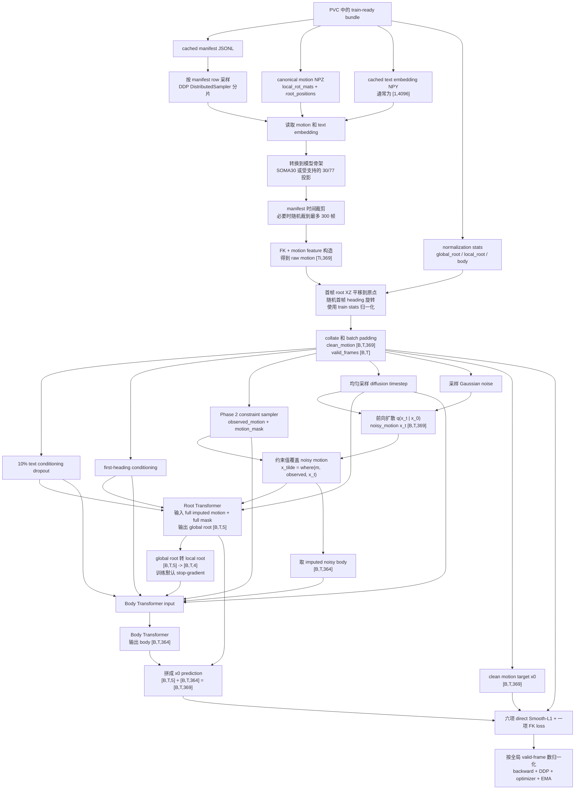
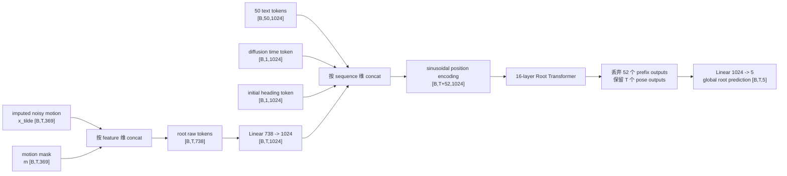
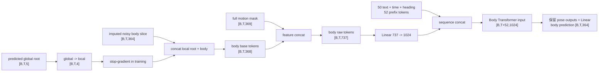
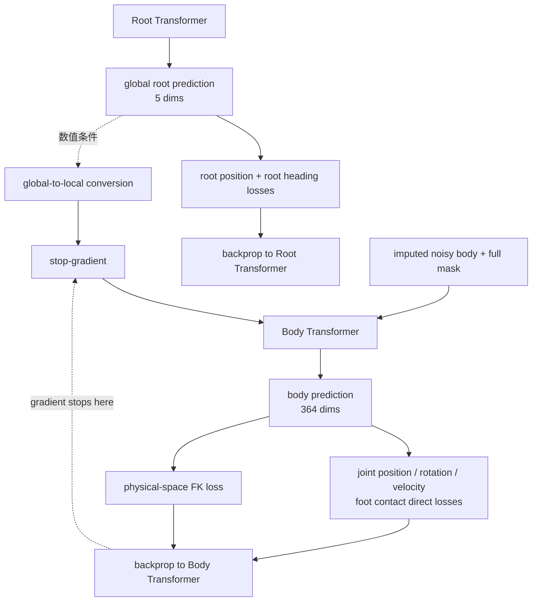

# Kimodo 训练数据流：从预处理 Bundle 到 Phase 2 Loss

本文描述当前仓库中 **V1/V2 通用训练代码** 的真实执行路径，重点以 Phase 2 为主，因为 Phase 2 包含完整的数据读取、扩散和两级 Transformer 前向；Phase 1 只是把动作约束关闭，并改变网络 dropout。

本文区分三类信息来源：

- **论文明确公开**：Kimodo 技术报告直接给出的表示、条件注入、两阶段课程和约束大类。
- **公开模型代码行为**：当前发布 backbone/two-stage forward 的实际实现，例如 50 个 conditioning slots、padding mask 和 root-to-body detach。
- **本仓库 V2 工程选择**：论文没有公开精确值、为了对齐公开 benchmark 而明确补充的采样分布，例如 13-leaf benchmark lane。

官方论文：<https://research.nvidia.com/labs/sil/projects/kimodo/assets/kimodo_tech_report.pdf>

---

## 1. 符号和固定维度

| 符号 | 含义 | 当前值/形状 |
|---|---|---|
| $B$ | 当前 rank 的 batch size | 生产配置为 128 |
| $T_i$ | 第 $i$ 个样本的真实帧数 | $2\le T_i\le 300$ |
| $T$ | 当前 batch 内最大帧数 | $T=\max_iT_i$ |
| $J$ | SOMA 模型骨架关节数 | 30 |
| $D$ | Kimodo motion feature 维度 | 369 |
| $H$ | Transformer latent width | 1024 |
| $N$ | diffusion 训练步数 | 1000 |
| $L_{text}$ | 原始 cached text token 数 | 当前通常为 1 |
| $L_{slot}$ | backbone 固定 conditioning text slots | 50 |

当前 369 维 motion representation 为：

| Feature block | 单帧维度 | 是否属于 global root | 作用 |
|---|---:|---:|---|
| `smooth_root_pos` | 3 | 是 | 平滑根节点的 $(x,y,z)$ 位置 |
| `global_root_heading` | 2 | 是 | 朝向的 $(\cos\theta,\sin\theta)$ |
| `local_joints_positions` | $30\times3=90$ | 否 | 以平滑 root 为参考构造的关节位置特征 |
| `global_rot_data` | $30\times6=180$ | 否 | 每个关节的全局 6D rotation representation |
| `velocities` | $30\times3=90$ | 否 | 全局关节速度 |
| `foot_contacts` | 4 | 否 | 四通道足接触标记 |
| **合计** | **369** | global root 5 + body 364 | 模型最终预测目标 |

因此：

$$
D_{global\ root}=3+2=5,
\qquad
D_{body}=369-5=364.
$$

第二级模型使用的 local root 不是 5 维 global root，而是：

$$
r^{local}
=
\left[
\dot\theta,
\dot p_x,
\dot p_z,
p_y
\right]
\in\mathbb R^4.
$$

---

## 2. 端到端总流程



一个最重要的边界是：**V2 的 LLM 文本增强属于离线 bundle；Phase 2 的动作约束 mask 属于训练时在线采样。** Bundle 不需要为每种约束提前保存一份 motion。

---

## 3. 从 PVC bundle 读取什么

### 3.1 Manifest 是索引和协议，不是大 tensor 本身

训练入口读取 cached manifest JSONL。每一行代表一个可采样的 motion-text pair，核心字段类似：

```json
{
  "id": "clip:timeline-multi:3:0",
  "motion": "motions/soma30-30fps/.../clip.npz",
  "text": "A person ...",
  "split": "train",
  "source_fps": 30.0,
  "start_time": 1.2,
  "end_time": 3.8,
  "frame_count": 943,
  "sample_kind": "timeline_multi_llm",
  "mixture_source": "v2_llm_multi",
  "text_embedding": "text-cache/.../embedding.npy",
  "text_cache_key": "...",
  "text_embedding_metadata": "text-cache/.../metadata.json",
  "text_embedding_sha256": "..."
}
```

其中：

- `motion` 指向 canonical motion 文件；相对路径以 manifest 所在目录为基准解析。
- `text` 是可审计的原始字符串，但训练前向不在线运行 LLM2Vec，真正输入是 `text_embedding`。
- `start_time/end_time` 定义该 row 使用同一源 motion 的哪个语义片段；没有这两个字段表示整段 motion。
- 同一个 motion 可以对应 full、event、timeline-multi 等多行文本，因此它可能被训练多次。
- `mixture_source` 用于统计数据混合来源，不作为模型输入。
- `id` 用于唯一性、复现和定位问题，不作为模型输入。

加载 manifest 时会检查：

1. 必需字段是否存在；
2. `id` 是否重复；
3. 同一 motion 是否跨 train/eval split 泄漏；
4. motion、embedding 和 metadata 是否存在；
5. 新 schema 下 embedding 的 cache identity、SHA-256、dtype 和 shape 是否匹配；
6. `frame_count` 和 `mixture_source` 是否有效。

生产配置使用 reference inventory，trainer 启动时由 rank 0 验证 bundle/provenance，再广播结果；每个 rank 不需要各自完整扫描所有大文件。

### 3.2 DDP 如何分配 manifest rows

所有 rank 构建相同的 dataset，然后 `DistributedSampler` 根据：

- `world_size`；
- 当前 `rank`；
- 固定 seed；
- 当前 epoch；

生成确定性的 shuffled row indices。`drop_last=true` 保证各 rank batch 数一致。两机 16 卡时通常每个 GPU 一个进程，每个 rank 只读取自己那部分 row；PVC 提供所有 Pod 都能访问的相同文件路径。

这里的“数据分片”是 row index 分片，不是把 369 维 tensor 切给多张卡。每张卡仍得到完整 motion 样本，DDP 在反向阶段同步参数梯度。

### 3.3 V2 manifest 的 row-uniform 数据混合

当前 V2 配方的目标 manifest 共 1,440,741 rows。按 row 均匀采样时，来源分布为：

| Row 类型 | 数量 | Row 比例 |
|---|---:|---:|
| Full-motion overview | 898,205 | 62.3433% |
| Single event | 318,647 | 22.1169% |
| Timeline-multi LLM | 223,889 | 15.5399% |

这些比例是 V2 manifest 的工程分布，不是论文公开的训练 mixture。V2 删除 190,332 条机械 `Then` combined rows，新增 223,889 条 natural timeline-multi rows，净增 33,557 rows；不是把全部训练描述翻倍。

70,169 是唯一 ordered source-text tuple/LLM request 数，生成结果会传播到 223,889 个 motion-span rows。因此训练中的 row-level 重复与 LLM 独立生成数量不是一回事。

---

## 4. 单个 manifest row 如何变成 `clean_motion [T_i,369]`

### 4.1 读取 canonical motion

生产 bundle 的 canonical same-FPS NPZ 主要保存：

```text
local_rot_mats: [T_source, J, 3, 3]
root_positions: [T_source, 3]
```

也就是说，bundle 并不直接为每个 row 保存最终 `[T,369]`。DataLoader worker 读取基础旋转和 root trajectory 后，在线推导其余特征。

如果源不是 canonical same-FPS NPZ，则走通用 loader 完成格式转换和重采样。模型只自动支持 SOMA 30 与 SOMA 77 的确定性投影；其他骨架必须在进入训练前 retarget。

### 4.2 两级裁剪顺序

裁剪严格按以下顺序执行。

第一层是 manifest 语义裁剪。若存在 `start_time/end_time`：

$$
s=\max\left(0,\operatorname{round}(t_{start}\cdot fps)\right),
$$

$$
e=\min\left(T_{source},\operatorname{round}(t_{end}\cdot fps)\right).
$$

然后同时裁剪 rotations 和 root positions：

$$
R\leftarrow R[s:e],
\qquad
p\leftarrow p[s:e].
$$

第二层是训练最大长度裁剪。当前配置 `max_seconds=10`、`fps=30`，所以：

$$
T_{max}=10\times30=300.
$$

如果语义裁剪后的长度仍大于 300，则均匀随机选择一个合法起点：

$$
s_{random}\sim
\operatorname{UniformInteger}\left(0,T_i-T_{max}\right),
$$

再截取连续 300 帧。

随机数 seed 由 `base_seed + epoch * dataset_size + row_index` 决定，因此同一 epoch/index 可复现，不同 epoch 可以看到长 motion 的不同窗口。

注意：这一步是**时间连续但非语义感知**的随机裁剪。代码不会重新改写 caption。对本身不超过 300 帧的 V2 timeline-multi span 没有影响；对于很长的 full-motion row，overview 文本可能描述整段而训练实际只看到其中 10 秒，这是当前实现的已知语义边界。

### 4.3 从旋转和 root trajectory 构造 369 维 motion

对裁剪后的：

$$
R^{local}\in\mathbb R^{T_i\times J\times3\times3},
\qquad
p^{root}\in\mathbb R^{T_i\times3},
$$

先做 forward kinematics，得到：

- 全局关节旋转 $R^{global}$；
- 全局关节位置 $P^{global}$；
- 以 pelvis 为原点的局部关节位置。

随后构造六个 feature blocks：

1. 对 root trajectory 做平滑，得到 `smooth_root_pos`，3 维。
2. 从身体朝向计算 heading angle $\theta_t$，保存为：

   $$
   h_t=(\cos\theta_t,\sin\theta_t).
   $$

   使用二维 cos/sin 而不是直接存角度，可避免 $-\pi$ 与 $\pi$ 的数值跳变。

3. 构造相对平滑 root 的 `local_joints_positions`，$30\times3=90$ 维。
4. 把全局关节 rotation matrix 转成连续 6D rotation representation，$30\times6=180$ 维。
5. 按 30 fps 计算全局关节速度，$30\times3=90$ 维。
6. 根据脚部位置与速度阈值计算四通道 `foot_contacts`。

最后按固定顺序拼接：

$$
x^{raw}_0=
\left[
p^{smooth},
h,
P^{local},
R^{global}_{6D},
V^{global},
C^{foot}
\right]
\in\mathbb R^{T_i\times369}.
$$

### 4.4 平移、heading augmentation 和 `first_heading_angle`

构造 raw features 后，先把第 0 帧平滑 root 的 $(x,z)$ 平移到原点：

$$
p^{smooth}_{t,xz}
\leftarrow
p^{smooth}_{t,xz}-p^{smooth}_{0,xz}.
$$

训练模式下，再采样目标初始朝向：

$$
\theta_{first}\sim\mathcal U(0,2\pi),
$$

并把整段 motion 的位置、heading、全局 rotation 和 velocity 一致旋转，使第 0 帧 heading 等于该角度。足接触通道不随水平旋转改变。

标量 `first_heading_angle = \theta_{first}` 单独保留，稍后转成：

$$
c_{dir}=(\cos\theta_{first},\sin\theta_{first})\in\mathbb R^2
$$

并作为一个 conditioning token 输入两个 Transformer。它不用于 loss，也不属于 369 维 motion。

### 4.5 Normalization

最后使用 train split 预先统计的 mean/std 做逐特征归一化：

$$
x_0=
\frac{x^{raw}_0-\mu}
{\sqrt{\sigma^2+\epsilon}},
\qquad
\epsilon=10^{-5}.
$$

此时得到真正进入训练的：

```text
clean_motion: [Ti,369], float32, normalized
```

global root、local root 和 body stats 分目录保存；369 维 global representation 使用 global-root stats 与 body stats 拼成的统计量，5→4 的 root conversion 则使用独立 local-root stats。

---

## 5. Cached text 如何进入 batch

### 5.1 离线编码

训练不会在 GPU step 内运行 8B LLM2Vec，也不会运行 MiMo/Qwen。文本增强与 embedding 缓存已经在 bundle 构建阶段完成。

每条不同文本先 sanitize，再由固定版本 LLM2Vec 编码为：

$$
c_{text}\in\mathbb R^{1\times4096}.
$$

训练时 DataLoader 只读取 float32 `.npy`。V2 的多条增强描述是多条 manifest rows；不是一次把多个 caption 塞进同一样本的 50 个槽位。

### 5.2 Collate padding

设当前 batch 中真实 motion 长度为 $T_1,\ldots,T_B$，则：

$$
T=\max_iT_i.
$$

collate 创建：

```text
clean_motion      [B,T,369]   超出 Ti 的帧补 0
lengths           [B]
valid_frames      [B,T]       valid_frames[i,t] = (t < Ti)
first_heading     [B]
text_features     [B,Ltext,4096]
text_pad_mask     [B,Ltext]
```

`valid_frames` 不会被拼进 369 维 motion。它是独立 metadata，后面用于 attention、root finite differences、loss 和全局 valid-frame 归一化。

不同 DDP rank 的本地 batch 可以具有不同的 $T$；DDP 只要求各 rank 产生相同参数集合的梯度，不要求输入序列长度相同。

### 5.3 10% text conditioning dropout

每个样本独立采样：

$$
d_i\sim\operatorname{Bernoulli}(0.1).
$$

若 $d_i=1$，则把该样本的整个 text embedding 置零。这用于 classifier-free guidance 的 unconditional/constraint-only 分支，不是 Transformer 内部 dropout。

helper 同时会把该样本的 `text_pad_mask` 设为 False，但官方兼容配置 `use_text_mask=false` 随后又会把固定 50 slots 全部覆盖成 attention-valid。因此当前真正形成无文本条件的是 **embedding 清零**，不是靠 attention mask 删除 text tokens；全零输入经过带 bias 的 text projection 后也不保证投影结果逐元素为零。

---

## 6. Phase 2 在线动作约束采样

### 6.1 输出不是一张 mask，而是两张同形张量

约束 sampler 从 normalized clean motion $x_0$ 构造：

```text
motion_mask m       [B,T,369], bool
observed_motion y   [B,T,369], float
```

定义为：

$$
m_{btj}=
\begin{cases}
1,&\text{该帧该 feature 被约束},\\
0,&\text{否则},
\end{cases}
$$

$$
y=m\odot x_0.
$$

未约束位置的 `observed_motion` 为零。训练中 $y$ 来自 ground truth，用来模拟用户在推理时提供的已知轨迹、关键帧或末端执行器约束。

`observed_motion` 不会作为第三块完整 feature 拼进 Transformer；它只用于覆盖 noisy motion。真正额外拼入 motion token 的是二值 `motion_mask`。

### 6.2 Phase 2 顶层概率

当前 V2 production 配置为：

| Lane | 占全部 Phase 2 样本 | 来源 |
|---|---:|---|
| 无动作约束 | 10% | 论文公开 |
| paper-two：五类中无放回抽两类并取 mask 并集 | 25% | 论文公开顶层比例 |
| benchmark 13-leaf lane | $(1-0.1)\times0.25=22.5\%$ | V2 工程选择 |
| paper-single：五类中抽一类 | 42.5% | 剩余概率 |

因此 Phase 2 总 constrained probability 始终是 90%。V2 没有提高 constrained probability，而是从原 paper-single 的 65% 中拿出 22.5% 给 benchmark lane。

文本 dropout 与动作约束独立，所以 Phase 2 的联合输入比例为：

| 实际 conditioning | 概率 |
|---|---:|
| text + constraint | 81% |
| constraint only | 9% |
| text only | 9% |
| unconditional | 1% |

### 6.3 论文五类 pattern

论文给出五类约束形状，但没有公开五类内部概率，也没有公开 sparse count 的精确分布。本仓库在 paper lane 内均匀抽 family。

| Pattern | 选哪些帧 | 在 369 维中置 1 的部分 |
|---|---|---|
| `full_body_sparse` | 稀疏随机关键帧 | smooth root 3D、heading 2D、全部 local joint positions |
| `end_effector_sparse` | 稀疏随机关键帧 | 随机 1–4 组手/脚的位置与旋转，同时提供对应 root/heading support |
| `root_sparse` | 稀疏随机关键帧 | root $(x,z)$，50% 概率再包含 heading |
| `root_dense` | 一段连续帧 | root $(x,z)$，50% 概率再包含 heading |
| `foot_contact_sparse` | 稀疏随机关键帧 | 四通道 foot contact configuration |

Phase 2 进度为：

$$
p=\operatorname{clip}
\left(
\frac{step-S_1}{S_2-1},0,1
\right),
$$

其中 $S_1=500000$，$S_2=500000$。Sparse keyframe 数量上限线性增长：

$$
K_{max}(p)=\operatorname{round}(1+19p).
$$

实际 keyframe count 并不固定为 $K_{max}$，而是按当前工程分布：

$$
P(K=k)=
\frac{k^{-1}}
{\sum_{j=1}^{K_{max}}j^{-1}},
\qquad
1\le k\le K_{max},
$$

所以即使 Phase 2 后期允许 20 个 keyframes，也仍偏向较少 keyframes。

`root_dense` 当前先在 $[0.2T_i,0.8T_i]$ 中均匀选连续 span 长度，再均匀选合法起点。`20%–80%`、五类均匀采样、$k^{-1}$ 都是本仓库明确记录的复现选择，不应写成论文公开值。

### 6.4 V2 benchmark 13-leaf lane

V2 lane 对齐公开 benchmark 的约束**形状**：

| Leaf group | 具体覆盖 |
|---|---|
| Full-body | 首尾 endpoint inbetweening；随机 full-body keyframes |
| End-effector | 双脚；双手；双手+双脚的位置和旋转 |
| Root | 完整 2D root path；稀疏 root waypoints；两者分别含或不含 heading |
| Mixture | root+hands；root+hands+full-body；root path+RightHand/LeftFoot+full-body；root path+full-body |

13 个 leaf 在 benchmark lane 内均匀选择，其中 9 个标记为 atomic、2 个 two-component、2 个 three-component。Sparse count 最大为 9，当前分布为：

$$
P_{benchmark}(K=k)
=
\frac{k^{-0.45}}
{\sum_{j=1}^{K'_{max}}j^{-0.45}},
\qquad
K'_{max}=\min(K_{max},9,T_i).
$$

13-leaf 等概率、占全部 Phase 2 样本 22.5%、最大 9 和幂次 0.45 都是 benchmark-oriented 工程选择，不是 NVIDIA 未公开训练 recipe。当前 sampler 也没有按 3–10 秒时长桶重新平衡，因此“constraint shape coverage”不能表述成“完整 benchmark train distribution parity”。

此外，constraint lane 与 manifest 的 `sample_kind/mixture_source` 独立：benchmark lane 的 with-text 样本仍按约 62.34% full、22.12% single、15.54% timeline-multi 的 row 分布取文本；text presence 仍是约 90% with-text、10% no-text。公开 benchmark 的 `constraints_withtext` 使用 overview prompt，并同时设置 with-text/notext 评测类别。因此当前 V2 只是在训练中增加 **constraint taxonomy/shape coverage**，没有对齐 `(leaf × text presence × prompt type × duration)` 的完整联合分布。

---

## 7. 前向扩散：从 `clean_motion` 得到脏动作

### 7.1 Cosine noise schedule

训练使用 $N=1000$ 的 cosine schedule。连续形式定义：

$$
\bar\alpha(u)
=
\cos^2\left(
\frac{u+0.008}{1.008}\frac{\pi}{2}
\right).
$$

离散 beta 为：

$$
\beta_t
=
\min\left(
1-
\frac{\bar\alpha\left(\frac{t+1}{N}\right)}
{\bar\alpha\left(\frac{t}{N}\right)},
0.999
\right),
$$

$$
\alpha_t=1-\beta_t,
\qquad
\bar\alpha_t=\prod_{s=0}^{t}\alpha_s.
$$

### 7.2 每个样本独立采样 timestep 和 noise

$$
t_i\sim\operatorname{UniformInteger}(0,N-1),
$$

$$
\epsilon_i\sim\mathcal N(0,I),
$$

$$
x_t
=
\sqrt{\bar\alpha_t}\,x_0
+
\sqrt{1-\bar\alpha_t}\,\epsilon.
$$

`x_t`、`x_0` 和 $\epsilon$ 的形状均为 `[B,T,369]`。

当前模型直接预测 clean motion $x_0$，不是预测 noise $\epsilon$。虽然 padding 帧也会被加噪，但它们作为 attention key/value 被屏蔽，并且不参与 loss。

当前训练也没有额外的 SNR weighting 或 timestep-dependent loss weighting；不同 $t$ 的样本通过均匀 timestep 采样进入相同的七项 $x_0$ loss。

---

## 8. 约束注入：先覆盖值，再拼 binary mask

模型 forward 内先做：

$$
\tilde x_t
=
\operatorname{where}(m,y,x_t)
=
m\odot x_0+(1-m)\odot x_t.
$$

其中 $y=m\odot x_0$ 只在 $m=1$ 的位置保存有效观察值。

因为 $y$ 在约束位置等于 clean target，含义是：

- 约束位置：把 noisy feature 精确替换成已知目标；
- 未约束位置：保留 diffusion noisy feature。

然后沿 feature 维拼接二值 mask：

$$
x^{root}_{raw}
=
[\tilde x_t;m]
\in\mathbb R^{B\times T\times738}.
$$

当没有动作约束时：

$$
m=0,
\qquad
y=0,
\qquad
\tilde x_t=x_t.
$$

架构仍保持 738/737 输入，只是 mask 半边全零。Phase 1 就是这种情况。

---

## 9. 三种 mask 的区别

| 名称 | 形状 | 是否作为数值特征拼进 Transformer token | 真实作用 |
|---|---:|---:|---|
| `motion_mask` | `[B,T,369]` | **是** | 告诉模型哪些 motion coordinates 是已知约束；同时决定 imputation |
| `valid_frames` / `x_pad_mask` | `[B,T]` | 否 | attention padding、长度恢复、root finite differences、loss masking |
| `text_pad_mask` | `[B,Ltext]`，backbone 内 pad 到 50 | 否 | 通用文本 padding 接口；官方配置 `use_text_mask=false` 时被改为全 True |

不要把它们混为“mask 矩阵”。只有 `motion_mask` 是模型 motion feature 的一部分。

`valid_frames` 在 Transformer 内被拼到 prefix mask 后取反，形成 PyTorch 的：

```text
src_key_padding_mask: [B,T+52]
```

因此有效 query 不会读取 padding motion 作为 key/value。Transformer 仍计算矩形 tensor；mask 不会改变 `[B,T+52,1024]` 的 shape。padding query 可能产生输出，但这些位置最终被 loss mask 丢弃。

官方发布配置 `use_text_mask=false` 会让 50 个 text slots 全部可以参与 attention。其实际效果是让 49 个全零 extra slots 能够充当 register-like workspace；如果把它们当普通 padding 屏蔽，extra-token 设计就失效。

---

## 10. Conditioning prefix：为什么是 `T+52`

每个 Root/Body Transformer 都使用相同结构但参数独立：16 layers、8 heads、latent 1024、FFN 2048。

### 10.1 Text slots

真实 cached embedding 通常为：

$$
c_{text}\in\mathbb R^{B\times1\times4096}.
$$

backbone 补 49 个全零向量：

$$
C_{text+extra}
\in\mathbb R^{B\times50\times4096}.
$$

这里不是 50 条不同文字，而是：

```text
1 个真实 LLM2Vec sentence embedding
49 个 all-zero extra/register-like slots
```

在每个 stage 内，50 个 slots 使用该 stage 自己的同一个 `Linear(4096→1024)` 投影；Root 与 Body 的 text projection 参数彼此独立。对任一 stage：

$$
E_{text}
=
C_{text+extra}W_{text}+b_{text}
\in\mathbb R^{B\times50\times1024}.
$$

零槽位经过 bias、不同位置的 sinusoidal positional encoding 和多层 self-attention 后不再等价，可以作为内部信息交换空间。论文只比较过“49 extra”与“无 extra”，没有公开数量 sweep，因此 50 是官方采用值，不是已证明的全局最优甜点。

### 10.2 Diffusion timestep token

整数 timestep $t$ 先查 sinusoidal positional table，再经过：

$$
\operatorname{Linear}\rightarrow\operatorname{SiLU}\rightarrow\operatorname{Linear},
$$

得到：

$$
E_t\in\mathbb R^{B\times1\times1024}.
$$

它告诉 denoiser 当前输入含多少噪声，不是 motion 序列中的物理时间帧。

### 10.3 Initial heading token

前面保存的标量 angle 先转换为：

$$
(\cos\theta_{first},\sin\theta_{first}),
$$

再经过 `Linear(2→1024)`，得到：

$$
E_{heading}\in\mathbb R^{B\times1\times1024}.
$$

所以总 prefix 数量为：

$$
50+1+1=52.
$$

发布代码中 checkpoint-sensitive 的实际序列顺序是：

```text
[text slots 0..49, diffusion timestep slot 50, heading slot 51, pose tokens 52..T+51]
```

整段序列随后再加 positional encoding，因此这里的顺序不只是流程图排版细节。

---

## 11. Root Transformer 的精确数据流



Root Transformer 虽然只输出 5 维 root，但它看到了完整 369 维 imputed motion 和完整 369 维 mask。因此 root trajectory 可以和 noisy body、文本及身体约束协调。

---

## 12. Global root 转 local root 和 detach

Root Transformer 输出 normalized global root：

$$
\hat r^{global}_0
=
[\hat p_x,\hat p_y,\hat p_z,\widehat{\cos\theta},\widehat{\sin\theta}]
\in\mathbb R^{B\times T\times5}.
$$

转换函数先用 global-root stats 反归一化，再恢复：

$$
\hat\theta_t
=
\operatorname{atan2}
(\widehat{\sin\theta_t},\widehat{\cos\theta_t}),
$$

然后使用 `lengths` 做不跨 padding 的有限差分：

$$
\dot\theta_t\approx fps\cdot(\theta_{t+1}-\theta_t),
$$

实际 angular difference 通过 cos/sin 与 `atan2` 计算 wrapped angle difference，以正确跨过 $-\pi/\pi$ 边界。线速度和角速度都把每条有效序列最后一帧的速度复制为倒数第二帧速度，而不是跨入 padding 帧求差分。

$$
(\dot p_x,\dot p_z)_t
\approx
fps\cdot
\left(
p_{t+1,xz}-p_{t,xz}
\right).
$$

与绝对 root height 拼接，并用 local-root stats 重新归一化：

$$
\hat r^{local}_0
=
[\dot\theta,\dot p_x,\dot p_z,p_y]
\in\mathbb R^{B\times T\times4}.
$$

训练默认执行：

$$
\bar r^{local}_0
=
\operatorname{stopgrad}
(\hat r^{local}_0).
$$

这意味着 body loss 在数值上依赖 root prediction，但不会通过这座桥回传给 Root Transformer。`slice`、5→4 转换和 `concat` 本身都可微；真正截断梯度的是显式 `no_grad()/detach()`。

公开技术报告描述了 root→local-root→body 的数值前向，但没有公开官方 trainer 的完整 autograd 说明；本仓库默认 detach 是为了匹配发布 denoiser 的 training-mode forward。两个 Transformer 仍在同一个 optimizer step 中共同更新，只是 body loss 不跨桥更新 root 参数。

在 `eval` mode 下，这个显式 detach 分支关闭，以便需要时对 denoising/guidance 路径求梯度；普通推理若外层使用 `torch.no_grad()`，仍然不会建立 autograd graph。

---

## 13. Body Transformer 的精确数据流

Body Transformer 不读取 Root Transformer 的 hidden states。它读取：

1. Root Transformer 最终预测转换成的 4 维 local root；
2. 未经过 Root Transformer 的 imputed/noisy body slice；
3. 原始 369 维 motion constraint mask；
4. 与 Root Transformer 相同类型的 text/time/heading prefix。

先从 $\tilde x_t$ 去掉前 5 维 global root：

$$
\tilde x_t^{body}
\in\mathbb R^{B\times T\times364}.
$$

拼上预测 local root：

$$
x^{body}_{base}
=
[\bar r^{local}_0;\tilde x_t^{body}]
\in\mathbb R^{B\times T\times368}.
$$

因此 368 来自：

$$
4+364=368,
$$

不是拼 mask 后的最终输入。随后继续拼完整 369 维 mask：

$$
x^{body}_{raw}
=
[x^{body}_{base};m]
\in\mathbb R^{B\times T\times737}.
$$

Body 使用完整 369 维 mask，是为了仍然知道原 global-root/body representation 中哪些 coordinates 被约束。



最后拼回 369 维 clean-motion prediction：

$$
\hat x_0
=
[\hat r^{global}_0;\hat b_0]
\in\mathbb R^{B\times T\times369}.
$$

---

## 14. 从 `x0 prediction` 到七项 loss

### 14.1 模型预测目标

损失比较：

```text
prediction = x0 prediction [B,T,369]
target     = clean_motion  [B,T,369]
```

没有直接对 sampled noise $\epsilon$ 做 MSE，也没有把 motion constraint mask 作为 loss mask。模型对所有**有效帧、全部 369 个目标特征**预测 clean motion；约束 mask 只是输入条件。

### 14.2 Valid-frame masked Smooth-L1

定义 Smooth-L1：

$$
\operatorname{SL1}_{\beta}(\delta)
=
\begin{cases}
\dfrac{\delta^2}{2\beta},&|\delta|<\beta,\\[6pt]
|\delta|-\dfrac{\beta}{2},&|\delta|\ge\beta,
\end{cases}
$$

当前 $\beta=1$。

对 feature group $g$，设其维度为 $d_g$，定义未除 valid-frame 数的 numerator：

$$
S_g
=
\sum_{b=1}^{B}
\sum_{t=1}^{T}
v_{bt}
\left[
\frac{1}{d_g}
\sum_{j=1}^{d_g}
\operatorname{SL1}_{\beta}
\left(
\hat x^{(g)}_{0,btj}-x^{(g)}_{0,btj}
\right)
\right],
$$

其中：

$$
v_{bt}=\mathbb 1[t<T_b]
$$

就是 `valid_frames`。因此每项先对该帧内部 feature components 取平均，再对有效帧求和。

当前 V2 production profile 的六项 direct loss 在 **normalized feature domain** 计算：

| Loss | 对应 feature block | 权重 |
|---|---|---:|
| $L_{root\ position}$ | `smooth_root_pos` | 10 |
| $L_{root\ heading}$ | `global_root_heading` | 2 |
| $L_{joint\ position}$ | `local_joints_positions` | 10 |
| $L_{joint\ rotation}$ | `global_rot_data` | 10 |
| $L_{joint\ velocity}$ | `velocities` | 3 |
| $L_{foot\ contact}$ | `foot_contacts` | 4 |

这些权重是 loss coefficients，不是采样百分比。

### 14.3 Differentiable FK loss

当前实现固定在反归一化后的物理空间计算 FK。因此无论 direct losses 选 normalized 还是 physical，FK 分支都会先得到物理域的 prediction 和 target。

从 prediction 的 6D global rotations 得到 rotation matrices：

$$
\hat R^{global}
=
\operatorname{Rot6DToMatrix}
(\hat x^{global\_rot}_{0}),
$$

再转换为 local rotations：

$$
\hat R^{local}
=
\operatorname{GlobalToLocal}
(\hat R^{global}).
$$

目标关节位置 $P^{target}$ 从 target 的 `smooth_root_pos + local_joints_positions` 重建。当前实现用 **target root position** 锚定 predicted rotations：

$$
\hat P^{FK}
=
\operatorname{FK}
(\hat R^{local},P^{target}_{root}).
$$

FK numerator 为：

$$
S_{FK}
=
\sum_{b,t}
v_{bt}
\left[
\frac{1}{3J}
\sum_{j=1}^{J}
\sum_{c=1}^{3}
\operatorname{SL1}_{\beta}
\left(
\hat P^{FK}_{btjc}-P^{target}_{btjc}
\right)
\right].
$$

权重为：

$$
\lambda_{FK}=5.
$$

使用 target root 而不是 predicted root，意味着 FK 项主要监督 body articulation/rotation，不会再次通过 predicted root trajectory 重复惩罚 root 误差。

更精确地说，FK 的直接 activation gradient 只进入 prediction 的 `global_rot_data` slice；它不直接进入 predicted root-position slice，也不直接进入 predicted `local_joints_positions` slice。由于这些输出共享 Body Transformer 参数，FK 仍会更新 Body Transformer。比较时包含全部 $J$ 个关节；在 target-root anchor 下 root joint 的位置误差结构性为零，但仍包含在每帧 $3J$ 的归一化分母中。

### 14.4 总 loss 与全局 valid-frame normalization

设当前 optimizer step 在所有 ranks 和所有 gradient-accumulation microbatches 上的有效帧数为：

$$
V_{global}
=
\sum_{r=1}^{world\_size}
\sum_{micro}
\sum_{b,t}v^{(r,micro)}_{bt}.
$$

同样把前两节定义的本地 numerator 汇总到所有 ranks 和 accumulation microbatches：

$$
S_g^{global}
=
\sum_{r=1}^{world\_size}
\sum_{micro}
S_g^{(r,micro)},
\qquad
S_{FK}^{global}
=
\sum_{r=1}^{world\_size}
\sum_{micro}
S_{FK}^{(r,micro)}.
$$

全局目标为：

$$
\mathcal L
=
\frac{1}{V_{global}}
\left(
10S_{root\ position}^{global}
+2S_{root\ heading}^{global}
+10S_{joint\ position}^{global}
+10S_{joint\ rotation}^{global}
+3S_{joint\ velocity}^{global}
+4S_{foot\ contact}^{global}
+5S_{FK}^{global}
\right).
$$

实现不会先对每个 rank/microbatch 独立取均值再平均，因为可变长度 batch 会让短序列 rank 获得错误权重。代码实际做法是：

1. 每个 microbatch 对未除帧数的 numerator backward；
2. gradient accumulation 期间累加 numerator gradients；
3. DDP 对各 rank 梯度做平均；
4. `all_reduce` 得到全局 valid-frame count；
5. 乘以 `world_size / V_global`，恢复成正确的全局逐帧均值梯度；
6. gradient clip；
7. optimizer step。

这使两机 16 卡的梯度语义等价于把所有 rank 的有效帧组成一个全局 batch 后计算一次 loss。

---

## 15. Root/Body 两级模型到底分别被哪些 loss 更新

代码只调用一次七项总 loss，没有两个独立 loss API 或两个 optimizer。但最终 369 维输出的 feature slice 与 detach 共同形成以下梯度路由：



更准确地说：

- `root_position` 和 `root_heading` 直接监督 Root Transformer 输出。
- `joint_position`、`joint_rotation`、`joint_velocity`、`foot_contact` 和 FK 监督 Body Transformer 输出。
- Body forward 会因为 predicted local root 不同而改变，但训练默认 detach，所以这些 body losses 不更新 Root Transformer。
- 如果显式关闭 `detach_root_for_body`，上述 slice/转换/concat 都可微，body loss 才会穿过 local-root bridge 更新 Root Transformer。

---

## 16. Phase 1 与 Phase 2 的真正区别

两个训练 phase 使用**完全相同的**：

- 369 维 clean-motion target；
- cosine diffusion；
- Root/Body 两级前向；
- 50 text slots + time + heading；
- 七项 loss 及权重；
- root-to-body detach；
- optimizer、DDP valid-frame normalization 和 EMA。

区别只有 conditioning curriculum 和网络 dropout：

| 项目 | Phase 1：step 0–499,999 | Phase 2：step 500,000–999,999 |
|---|---|---|
| 动作约束 | 100% `m=0,y=0` | 90% constrained，10% no constraint |
| Constraint sampler | 不执行实际 pattern | paper lanes + V2 benchmark lane |
| Transformer/attention/PE dropout | 0.1 | 0.0 |
| Text conditioning dropout | 10% | 10% |
| Loss 公式和权重 | 与 Phase 2 相同 | 与 Phase 1 相同 |

Kimodo 技术报告 Sec. 4.3 明确给出的理由是：约束值已经直接 overwrite 到 noisy input，因此 Phase 2 移除模型 dropout，以免这些 conditioning constraints 被 dropout 干扰。

---

## 17. Optimizer、gradient clipping 与 EMA

当前 16-H200 V2 profile：

```text
optimizer              Adam-atan2
learning rate          2e-5
betas                  (0.9, 0.999)
atan2 lambda           8
weight decay           0
gradient clip norm     1.0
precision              BF16
per-rank batch         128
world size             16
gradient accumulation  1
effective global batch 2048
```

生产 BF16 不启用 `GradScaler`；只有 FP16 profile 才启用。当前没有 learning-rate warmup 或 scheduler，learning rate 在训练期间保持常数。

当前 Adam-atan2 对 bias-corrected first moment $\hat m$ 和 second-moment root $\sqrt{\hat v}$ 使用：

$$
u
=
\frac{4}{\pi}\lambda
\operatorname{atan2}
\left(
\hat m,\lambda\sqrt{\hat v}
\right),
\qquad
\theta\leftarrow\theta-\eta u,
$$

其中 $\lambda=8$；它没有标准 Adam 的 $\sqrt{\hat v}+\epsilon$ denominator。论文明确公开了 Adam-atan2 和 $2\times10^{-5}$ learning rate，但 betas、atan2 lambda、weight decay、constant schedule、BF16 和 clip norm 属于本仓库补全的工程配置。

每次有效 optimizer step 后更新 `global_step`。loss 和 global gradient norm 都会做跨 rank finite check；遇到非有限值会保存 diagnostic checkpoint 并 fail fast。每 10 个成功 optimizer steps 更新一次 EMA：

$$
\theta_{EMA}
\leftarrow
0.995\,\theta_{EMA}
+0.005\,\theta.
$$

EMA shadow 从 step 0 的完整 `model.state_dict()` 初始化：浮点参数和浮点 buffer 按上述公式插值，非浮点 buffer 直接复制；它不只跟踪 `requires_grad` 参数。EMA 跨 Phase 1/2 不重置。推理/benchmark 应使用导出的 EMA state，而不是任意一个瞬时训练状态。

---

## 18. Shape ledger：一次 Phase 2 forward 的全部关键形状

| 阶段 | Tensor | Shape |
|---|---|---:|
| 单样本加载 | raw local rotations | `[Ti,30,3,3]` |
| 单样本加载 | root positions | `[Ti,3]` |
| 单样本特征 | normalized clean motion | `[Ti,369]` |
| 单样本文本 | cached text embedding | `[1,4096]` |
| Collate | clean motion | `[B,T,369]` |
| Collate | valid frames | `[B,T]` |
| Conditioning | motion mask | `[B,T,369]` |
| Conditioning | observed motion | `[B,T,369]` |
| Diffusion | noise/noisy motion | `[B,T,369]` |
| Imputation | imputed noisy motion | `[B,T,369]` |
| Root raw input | imputed motion + mask | `[B,T,738]` |
| Root projected pose | root linear projection | `[B,T,1024]` |
| Root Transformer | prefix + pose | `[B,T+52,1024]` |
| Root output | predicted global root | `[B,T,5]` |
| Root conversion | predicted local root | `[B,T,4]` |
| Body base | local root + noisy/imputed body | `[B,T,368]` |
| Body raw input | body base + original mask | `[B,T,737]` |
| Body Transformer | prefix + projected pose | `[B,T+52,1024]` |
| Body output | predicted body | `[B,T,364]` |
| Final prediction | root + body | `[B,T,369]` |
| Loss metadata | valid frames | `[B,T]` |

---

## 19. 每个字段最后到底用在哪里

| 数据项 | 模型输入 | Loss 输入 | 其他用途 |
|---|---:|---:|---|
| `clean_motion` | 通过 diffusion/constraint 间接进入 | **是，作为 $x_0$ target** | 生成 online constraint target |
| `noisy_motion` | **是** | 否 | denoising source |
| `observed_motion` | 只用于 overwrite | 否 | 未约束处为零 |
| `motion_mask` | **是，拼入 feature** | 否 | 决定 overwrite 位置 |
| `valid_frames` | **是，attention mask** | **是，loss mask** | 计算 lengths、DDP 全局帧数 |
| `lengths` | 不作为 token | 否 | 约束采样、global→local finite difference |
| `text_features` | **是** | 否 | 10% 整条置零 |
| `text_pad_mask` | 通用 attention mask 接口 | 否 | 官方 `use_text_mask=false` 下最终全 True |
| `first_heading_angle` | **是，heading token** | 否 | 与随机全局旋转对应 |
| `timesteps` | **是，time token** | 否 | 决定前向加噪强度 |
| sampled noise $\epsilon$ | 通过 $x_t$ 间接进入 | 否 | 当前不是 noise-prediction target |
| raw `text` | 否 | 否 | manifest 审计和问题定位 |
| `id` | 否 | 否 | 唯一性与复现 |
| `mixture_source` | 否 | 否 | 训练数据来源统计 |

---

## 20. 当前实现与论文边界

### 论文明确支持

- motion representation 的 global root/body feature 语义与两级建模思路；
- constraint imputation：$\tilde x_t=m\odot x_{tgt}+(1-m)\odot x_t$；
- 把 binary control mask 沿 feature 维拼到 imputed motion；
- denoiser 直接预测 clean motion $x_0$，并使用七项加权 Smooth-L1 objective；
- 七项论文权重为 root position 10、root heading 2、joint position 10、joint velocity 3、joint rotation 10、foot contact 4、FK 5；
- 1 个 4096D LLM2Vec embedding + 49 个 zero extra tokens；
- first-heading conditioning；
- global-root Transformer 后接 local-root-conditioned Body Transformer；
- 500k text-only + 500k constraint curriculum；
- Phase 2 中 25% 双 pattern、10% 无动作约束；
- sparse maximum 1→20、偏向少 keyframes；
- Phase 1 model dropout 0.1、Phase 2 移除；
- 两阶段 text dropout 10%；
- EMA 每 10 steps、decay 0.995。

### 公开代码/配置明确支持

- SOMA30 当前实现的精确 369 维 feature layout；
- `num_text_tokens_override=50`、`use_text_mask=false`；
- 公开 backbone 接收正语义 `x_pad_mask` 并取反为 PyTorch `src_key_padding_mask`；本仓 trainer 将 `valid_frames` 作为该参数传入；
- Root 738、Body 737 的真实输入维度；
- Body 读取 predicted local root + imputed/noisy body，而不是 Root hidden state；
- 发布 forward 的 training-mode root-to-body detach。

### V2 工程选择，不应冒充未公开官方 recipe

- V2 的 full/event/timeline-multi row 比例；
- paper 五类均匀抽样；
- sparse count 的 $k^{-1}$ 分布；
- dense root span 的 20%–80%；
- root heading 50%；
- 22.5% benchmark lane、13 leaf 等概率、$K\le9$、$k^{-0.45}$；
- direct feature losses 使用 normalized domain；
- 当前 target-root FK 的具体实现和所有未由报告完全披露的训练细节。
- Smooth-L1 $\beta=1$、每帧先按 feature components 平均、跨 rank/micro 的 global-valid-frame reduction；
- FK 的 target-root anchor、6D rotation projection 和 root-joint denominator convention；
- Adam-atan2 的 $\lambda$/betas/weight decay/constant schedule，以及 BF16、gradient clip 和 DDP numerator normalization protocol。

---

## 21. 对应实现文件

- Manifest、裁剪、motion/text 加载与 collate：[`kimodo/training/data.py`](../kimodo/training/data.py)
- 369 维 motion representation：[`kimodo/motion_rep/reps/kimodo_motionrep.py`](../kimodo/motion_rep/reps/kimodo_motionrep.py)
- normalization：[`kimodo/motion_rep/stats.py`](../kimodo/motion_rep/stats.py)
- Phase 2 constraint sampler：[`kimodo/training/constraints.py`](../kimodo/training/constraints.py)
- diffusion：[`kimodo/model/diffusion.py`](../kimodo/model/diffusion.py)
- Transformer prefix、padding mask 和 50 slots：[`kimodo/model/backbone.py`](../kimodo/model/backbone.py)
- Root/Body 两级 forward 与 detach：[`kimodo/model/twostage_denoiser.py`](../kimodo/model/twostage_denoiser.py)
- 七项 loss：[`kimodo/training/losses.py`](../kimodo/training/losses.py)
- DDP、gradient normalization、optimizer 和 EMA 调用：[`kimodo/training/engine.py`](../kimodo/training/engine.py)
- 16-H200 V2 production 配置：[`configs/training/kimodo_soma_seed_v2_1m_16h200.yaml`](../configs/training/kimodo_soma_seed_v2_1m_16h200.yaml)
