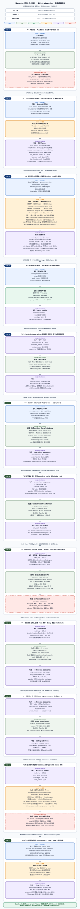
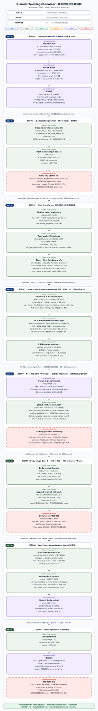
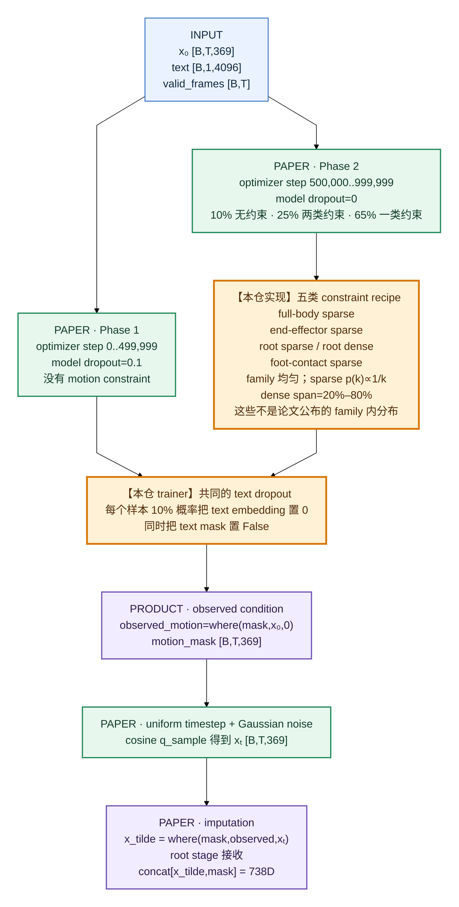
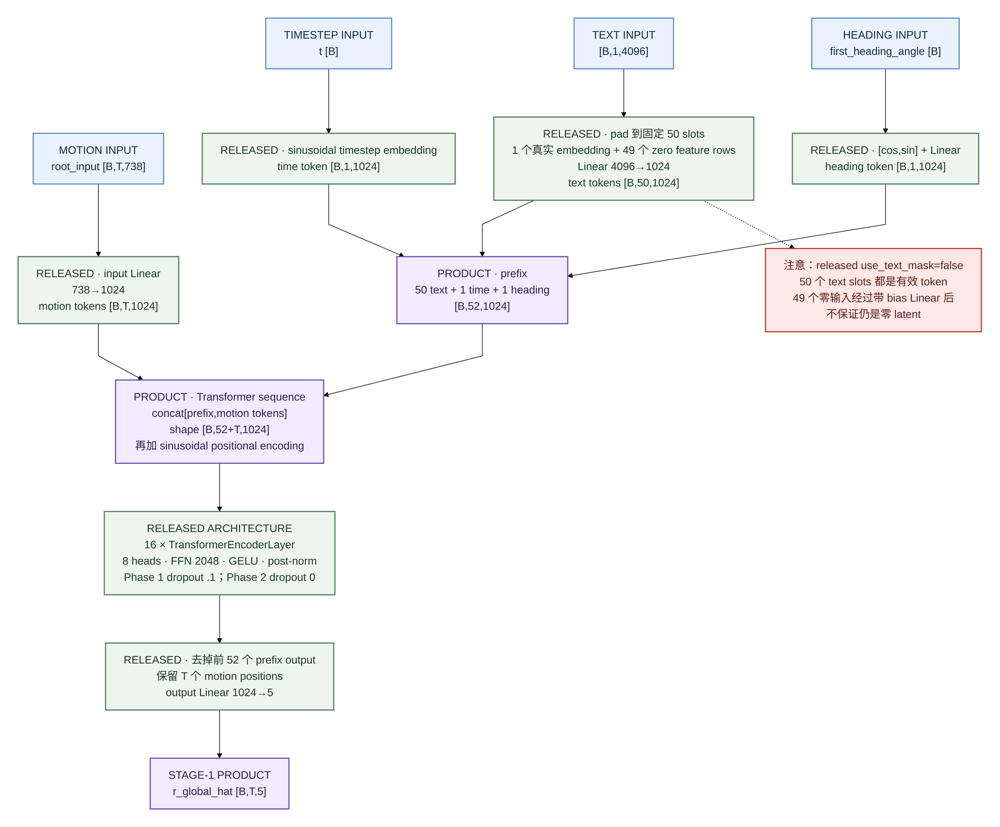
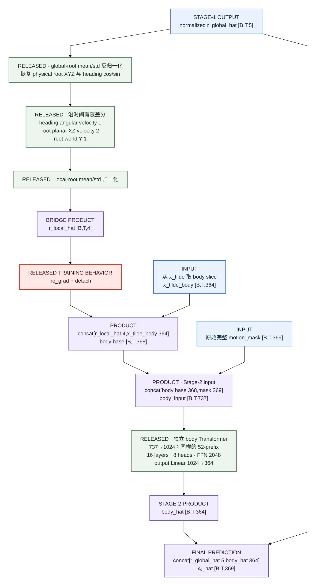
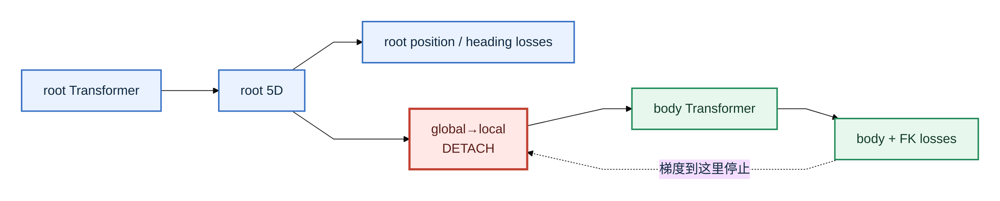
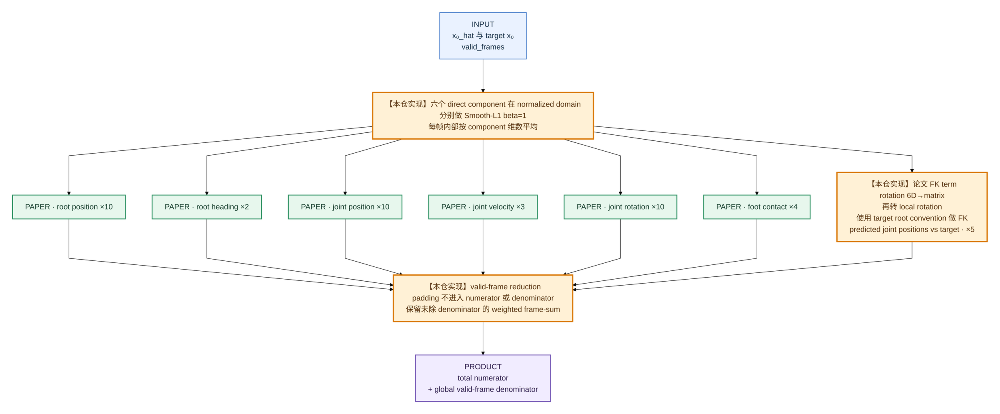
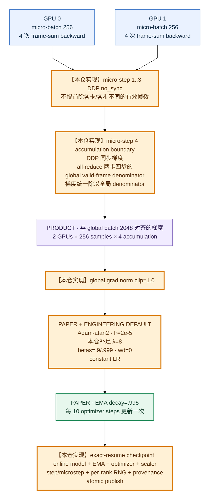

# Kimodo 两阶段 Transformer 训练 Flow

当前模型不是“先把 root 模型单独训完，再训练 body 模型”。每个 optimizer step 中，两个 Transformer 都做
forward、计算同一个总 loss、由同一个 optimizer 更新；“两阶段”指的是**同一次 forward 内先预测全局 root，
再把 root 转成局部运动条件交给 body Transformer**。

## 技术分享版总图

[打开 1800 px SVG 原图](assets/two_stage_training_technical_share.svg)



这张总图按唯一的纵向时间轴绘制。每个步骤内部也固定为“输入→处理→输出”，不再把并行说明、课程分支和
前后计算画成同一种并列卡片。1800 px 画布按文档中 900 px 显示宽度设计，正文无需放大即可阅读。

### 模型结构放大图：逐层观察维度怎样变化

[打开 1800 px SVG 原图](assets/model_architecture_technical_share.svg)



这张图只画 `TwostageDenoiser` 内部，不把数据预处理、DDPM 加噪、loss 和 optimizer 混进网络结构。上半图是
从外部输入到 `clean_motion [B,T,369]` 的完整主干；下半图放大 Root/Body 各自独立的
`TransformerEncoderBlock`，逐项解释 text/time/heading/motion 怎样成为 token、怎样组成 `52+T` 序列、
怎样经过 self-attention，以及为什么最后只保留 motion-token 输出。

## 图例

| 颜色 | 含义 |
|---|---|
| 蓝色 | DataLoader 输入或普通张量 |
| 绿色 | 论文明确的方法/数值 |
| 灰绿色 | NVIDIA 公开模型代码、配置或 checkpoint 给出的结构 |
| 橙色粗框 | **论文没有完整代码，本仓自行实现的 trainer/recipe/协议** |
| 紫色 | 一个阶段实际输出的张量 |
| 红色 | 梯度停止、缺失项或必须注意的边界 |

## 1. 一次 optimizer step 的清晰主干

这张总图只有一条从上到下的计算顺序。局部细节在后面的放大图中说明。

```mermaid
%%{init: {"theme":"base","flowchart":{"htmlLabels":true,"curve":"linear","useMaxWidth":false,"wrappingWidth":760,"diagramPadding":30,"nodeSpacing":64,"rankSpacing":80},"themeVariables":{"fontFamily":"Arial, Droid Sans Fallback, sans-serif","fontSize":"18px"},"themeCSS":".nodeLabel,.edgeLabel{text-align:center!important;line-height:1.7!important;padding:12px!important}.node foreignObject{overflow:visible!important}"}}%%
flowchart TB
    classDef input fill:#EAF2FF,stroke:#3973C6,color:#102A43,stroke-width:1.5px;
    classDef paper fill:#E7F7ED,stroke:#228B5A,color:#143D2B,stroke-width:2px;
    classDef released fill:#EEF5EE,stroke:#5C8465,color:#203629,stroke-width:2px;
    classDef ours fill:#FFF1D6,stroke:#D97706,color:#542D08,stroke-width:3px;
    classDef product fill:#F1ECFF,stroke:#7457B5,color:#2D1D4E,stroke-width:2px;
    classDef warning fill:#FFE8E6,stroke:#C24132,color:#5C1E18,stroke-width:3px;

    A["INPUT · DataLoader batch<br/><br/>x₀ clean_motion [B,T,369] normalized<br/>valid_frames [B,T] · lengths [B]<br/>text [B,1,4096] · text_pad_mask [B,1]<br/>first_heading_angle [B]"]:::input

    B["【本仓 trainer】课程与 conditioning 采样<br/><br/>按 optimizer global_step 决定 Phase 1/2<br/>执行 10% text conditioning dropout<br/>Phase 2 在线采样五类 motion constraint<br/>生成 observed_motion 与 motion_mask"]:::ours

    C["PRODUCT · conditioning<br/><br/>text_condition [B,1,4096]<br/>observed_motion [B,T,369]<br/>motion_mask [B,T,369] bool<br/>Phase 1 的 motion_mask 全 False"]:::product

    D["PAPER · DDPM forward noise<br/><br/>t ~ Uniform{0,...,999}<br/>ε ~ Normal(0,I)<br/>xₜ = sqrt(alpha_barₜ)x₀<br/>+ sqrt(1-alpha_barₜ)ε<br/>训练 target 是 clean x₀，不是 ε"]:::paper

    E["PAPER · constraint overwrite/imputation<br/><br/>x_tilde = where(mask, observed x₀, xₜ)<br/>已约束维度放干净观测<br/>其他维度保留 noisy motion"]:::paper

    F["PRODUCT · Stage-1 输入<br/><br/>concat[x_tilde 369, motion_mask 369]<br/>root_input = [B,T,738]"]:::product

    G["RELEASED MODEL · Stage 1<br/>Global-root Transformer<br/><br/>motion input 738→latent 1024<br/>text / time / first-heading<br/>共 52 个 prefix tokens<br/>16 layers · 8 heads<br/>输出 5D global root"]:::released

    H["PRODUCT · predicted global root<br/><br/>r_global_hat [B,T,5]<br/>smoothed root XYZ 3<br/>heading cos/sin 2"]:::product

    I["RELEASED MODEL · global→local bridge<br/><br/>global stats 反归一化<br/>有限差分生成 angular velocity<br/>以及 XZ velocity / root Y<br/>local stats 归一化<br/>training 默认 no_grad + detach"]:::released

    J["PRODUCT · Stage-2 输入<br/><br/>r_local_hat [B,T,4]<br/>x_tilde_body [B,T,364]<br/>concat 二者得 368，再 concat 原 369D mask<br/>body_input = [B,T,737]"]:::product

    K["RELEASED MODEL · Stage 2<br/>Body Transformer<br/><br/>与 root Transformer 参数不共享<br/>同样使用 52 个 prefix<br/>16 layers · 8 heads · latent 1024<br/>输出 body 364D"]:::released

    L["PRODUCT · clean-motion prediction<br/><br/>body_hat [B,T,364]<br/>concat 5D root 与 364D body<br/>x₀_hat [B,T,369]"]:::product

    M["【本仓 trainer】七项 loss 的可执行实现<br/><br/>6 个 normalized representation Smooth-L1<br/>+ 1 个 physical FK Smooth-L1<br/>只累计 valid frame<br/>权重 10/2/10/3/10/4/5"]:::ours

    N["PRODUCT · weighted frame-sum<br/>尚未除全局分母<br/>每项分别记录 numerator<br/>以及 valid-frame denominator"]:::product

    O["【本仓 trainer】DDP + accumulation<br/><br/>非边界 micro-step：DDP no_sync<br/>accumulation 边界<br/>all-reduce global valid-frame count<br/>再统一缩放梯度<br/>clip norm 1.0 → Adam-atan2<br/>→ EMA → full-state checkpoint"]:::ours

    P["UPDATED STATE<br/><br/>online root/body parameters<br/>optimizer state<br/>EMA shadow（每 10 optimizer steps 更新）<br/>step/microstep + per-rank RNG + provenance"]:::product

    Q["GRADIENT BOUNDARY<br/>body loss 不穿过 detached bridge<br/>因此不更新 root Transformer<br/>root Transformer 主要由<br/>root position / heading loss 更新"]:::warning

    A --> B --> C --> D --> E --> F --> G --> H --> I --> J --> K --> L --> M --> N --> O --> P
    I -.-> Q
```



## 2. 输入 369D 到底是什么

`clean_motion` 已经过数据流水线在线裁剪、随机 heading 和 normalize。最后一维不是抽象 embedding，而是
具有固定运动学语义的特征：

| slice | 维数 | 每帧含义 | 交给哪个 stage 预测 |
|---|---:|---|---|
| smoothed root XYZ | 3 | 平滑后的全局 root 位置 | root |
| heading cos/sin | 2 | 人体水平朝向，避免角度在 ±π 跳变 | root |
| joint positions | 90 | 30 个关节 × XYZ | body |
| global joint rotations | 180 | 30 个关节 × 6D rotation | body |
| joint velocities | 90 | 30 个关节 × XYZ velocity | body |
| heel/toe contacts | 4 | 左右脚跟/脚尖的接触信号 | body |
| **总计** | **369** | global root 5 + body 364 | — |

batch 中其他字段：

```python
{
  "clean_motion": float32[B, T, 369],
  "valid_frames": bool[B, T],          # True=真实帧，False=padding
  "lengths": int64[B],
  "text_features": float32[B, 1, 4096],
  "text_pad_mask": bool[B, 1],
  "first_heading_angle": float32[B],
}
```

这里 `B` 是单个 rank/GPU 的 micro-batch，`T≤300`。两卡、每卡 micro-batch 256、累计 4 个 micro-step 时，
目标 global batch 为 `2 × 256 × 4 = 2048`。

## 3. conditioning 与 diffusion 输入怎样构造



五类 constraint 的概念：

- `full-body sparse`：少数时间点给出整帧身体状态。
- `end-effector sparse`：少数时间点约束手、脚等末端。
- `root sparse`：少数时间点约束 root。
- `root dense`：连续一段时间约束 root 轨迹。
- `foot-contact sparse`：少数位置给出脚接触条件。

论文给出了 family、课程的大比例和 sparse 数量逐步增至 20；family 内如何抽取、dense 区间分布、heading
概率没有公开。图中的 `1/k`、20%–80%、family 均匀是**本仓实现**，不是官方最优 recipe。

## 4. Stage 1：Global-root Transformer 内部



`valid_frames=True` 表示真实 motion frame。送入 PyTorch Transformer 前会取反，成为
`src_key_padding_mask=True` 的 padding 位置。不要把它和 369D `motion_mask` 混淆：前者屏蔽补齐帧，后者
表示用户/课程给了哪些运动约束。

## 5. global→local bridge 与 Stage 2

body Transformer 不直接读取 5D global root，而读取它的局部变化形式。这样 body 更容易依据“向前移动多少、
朝向变化多少、root 多高”来生成关节运动。



### 梯度边界



公开 denoiser 的 training-mode forward 明确 detach。论文使用了 “end-to-end/interleaved” 描述，但未说明
bridge autograd，因此当前默认跟随公开 forward；不能进一步声称这就是未公开私有 trainer 的梯度策略。

## 6. 七项 loss 怎样汇合



论文公开了七项 loss 及权重，但没有公开 normalized/physical domain、Smooth-L1 `beta`、每项 reduction 和
FK root convention。图中橙色部分是本仓为得到确定、可测、可多卡等价的训练目标所做的实现选择。

## 7. 两卡、四步累计时怎样更新



不足 10 个 optimizer step 的短训中，EMA 可能仍基本等于初始化时复制的 online 权重，因此这种短训适合
验证吞吐、显存、forward/backward 和保存恢复，不适合判断收敛质量。

## 8. 哪些来自论文，哪些是本仓设计

### 论文明确且已实现

| 方法 | 当前实现 |
|---|---|
| 最长 10 秒、30 FPS best model | `T≤300` |
| 369D motion representation | global root 5 + body 364 |
| DDPM 1000 steps、uniform timestep、Gaussian noise、预测 clean x₀ | `q_sample` + x₀ loss |
| constraint overwrite 与 mask concat | root/body 输入均携带原始 369D mask |
| global-root→local-root→body | `[5]→[4]→body` |
| 两个 16-layer、8-head、latent-1024 Transformer | 两套独立参数 |
| Phase 1/2 各 500k | 按 optimizer global step 切换 |
| Phase 2：10% none、25% two；五类约束 | 在线 sampler |
| model dropout `.1→0`；text dropout 10% | phase 与 CFG conditioning |
| 七项 loss 权重 `10/2/10/3/10/4/5` | trainer loss wiring |
| Adam-atan2、lr `2e-5` | optimizer |
| EMA `.995` 每 10 step | trainer EMA |
| global batch 2048 | 两卡 256 micro × 4 accumulation |

### 公开模型代码/配置给出的结构

| 结构 | 采用方式 |
|---|---|
| FFN 2048、GELU、post-norm | 两个 Transformer 保持 checkpoint-compatible |
| text 固定 50 slots、first-heading token | prefix 总长 52 |
| `use_text_mask=false` | 50 个 text slots 均参与 attention |
| cosine beta schedule `.008/.999` | released diffusion primitive |
| training-mode bridge `no_grad + detach` | 当前默认保持公开 forward 语义 |
| official EMA inference weights | 仅可作为结构/权重 oracle，不是可恢复 trainer state |

### **本仓自行实现的 RECON 内容**

这些项目有配置、测试和 provenance，但不是论文公布的精确数值：

| 类别 | 本仓当前实现 | 论文/仓库缺少什么 |
|---|---|---|
| 完整训练循环 | BF16 forward/backward、两阶段联合 optimizer step | 官方没有 trainer |
| constraint family 内采样 | family 均匀；`p(k)∝1/k`；dense 20%–80%；heading p=.5 | family 内分布未公开 |
| direct loss | normalized domain、Smooth-L1 beta=1、每帧分量平均 | domain/beta/reduction 未公开 |
| FK loss | predicted rotation + target root convention | FK root 选择未公开 |
| DDP accumulation | frame-sum backward + global valid-frame denominator | 多卡累计协议未公开 |
| 稳定性 | BF16、grad clip 1.0、seed 1234 | precision/clip/seed 未公开 |
| Adam-atan2 其余参数 | λ=8、betas=.9/.999、wd=0、constant LR | 论文只给 optimizer 名和 LR |
| EMA lifecycle | online 初始化、跨 phase 连续、不重置 | lifecycle 未公开 |
| checkpoint | exact-resume full state、per-rank RNG、原子保存、provenance | 保存/恢复协议未公开 |
| stats | 自行拟合 global/local/body stats | 官方训练 stats recipe 未公开 |

### 没有进入当前训练输入

- Qwen3-32B paraphrase prompt/cache/mixture。
- cross-motion source pair、时间范围、坐标/heading 对齐。
- preliminary diffusion transition checkpoint。
- transition sampling、帧数、质量过滤、生成数量。
- 论文最终 full/single/combined/stitched 与 original/paraphrase mixture。

严格 paper-data profile 会因为这些数据和 provenance 缺失而拒绝启动；public profile 是可运行的工程 baseline，
不能命名为完整论文数据复现。公开 multi-prompt transition 是推理功能，也不能替代训练数据 augmentation。

## 9. 实现证据入口

- [`kimodo/training/engine.py`](../kimodo/training/engine.py)：课程、加噪、loss、DDP accumulation、更新主循环。
- [`kimodo/model/twostage_denoiser.py`](../kimodo/model/twostage_denoiser.py)：root/body forward 与 bridge。
- [`kimodo/model/backbone.py`](../kimodo/model/backbone.py)：Transformer、prefix、text-mask 行为。
- [`kimodo/model/diffusion.py`](../kimodo/model/diffusion.py)：cosine schedule 与 `q_sample`。
- [`kimodo/training/constraints.py`](../kimodo/training/constraints.py)：本仓 constraint sampler。
- [`kimodo/training/losses.py`](../kimodo/training/losses.py)：七项 loss 和 valid-frame reduction。
- [`kimodo/training/optim.py`](../kimodo/training/optim.py)：Adam-atan2。
- [`kimodo/training/checkpoint.py`](../kimodo/training/checkpoint.py)：full-state checkpoint。
- [`configs/training/kimodo_soma_seed_reproduction.yaml`](../configs/training/kimodo_soma_seed_reproduction.yaml)：严格训练配置。
- [`docs/paper_training_parity_audit.md`](paper_training_parity_audit.md)：论文证据和阻断项逐条审计。
